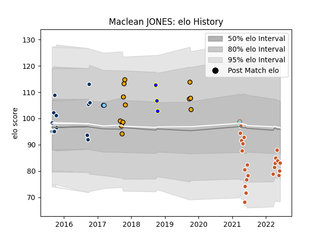

---  
layout: page  
title: Maclean JONES  
date: 2023-03-29 11:30:13.843074  
categories: player  
---
# Maclean JONES

Last updated: 2023-03-29
## Positions: FL

## Current elo: 83.0

## Current Percentile: 11.0

# Elo History

# Match History

| Team                     |   Appearances |   Win Rate |
|:-------------------------|--------------:|-----------:|
| Austin Gilgronis         |            22 |   0.681818 |
| Queensland Country       |            13 |   0.230769 |
| NSW Country Eagles       |            12 |   0.458333 |
| Sydney Rays              |             3 |   0        |
| New South Wales Waratahs |             2 |   0        |
| Austin Herd              |             1 |   0        |

| Opponent               |   Matches |   Win Rate |
|:-----------------------|----------:|-----------:|
| Brisbane City          |         4 |   0.125    |
| Houston SaberCats      |         4 |   1        |
| Melbourne Rising       |         3 |   0.333333 |
| Utah Warriors          |         3 |   0        |
| Seattle Seawolves      |         3 |   1        |
| San Diego Legion       |         3 |   0.666667 |
| Queensland Country     |         3 |   0        |
| Canberra Vikings       |         3 |   0.333333 |
| Perth Spirit           |         3 |   0.333333 |
| Greater Sydney Rams    |         3 |   0.333333 |
| New England Free Jacks |         2 |   0        |
| North Harbour Rays     |         2 |   0        |
| L. A. Giltinis         |         2 |   0        |
| NSW Country Eagles     |         2 |   1        |
| Fijian Drua            |         2 |   0        |
| NOLA Gold              |         1 |   1        |
| Sydney Rays            |         1 |   1        |
| Dallas Jackals         |         1 |   1        |
| Toronto Arrows         |         1 |   1        |
| Sydney Stars           |         1 |   0        |
| Rugby New York         |         1 |   1        |
| Sharks                 |         1 |   0        |
| Rugby ATL              |         1 |   1        |
| R.U. New York          |         1 |   1        |
| Lions                  |         1 |   0        |
| Western Force          |         1 |   1        |