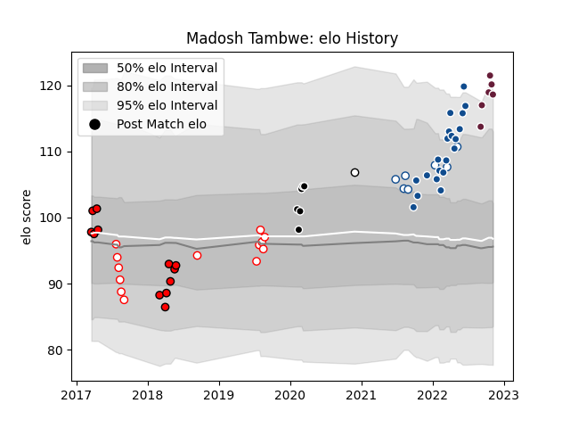

---  
layout: page  
title: Madosh Tambwe  
date: 2022-12-09 13:23:30.153698  
categories: player  
---
# Madosh Tambwe

## Positions: W

## Current elo: 119.0

## Current Percentile: 93.0

# Elo History

# Match History

| Team            |   Appearances |   Win Rate |
|:----------------|--------------:|-----------:|
| Bulls           |            20 |   0.65     |
| Golden Lions    |            13 |   0.538462 |
| Lions           |            12 |   0.833333 |
| Bordeaux Begles |             8 |   0.4375   |
| Blue Bulls      |             7 |   0.857143 |
| Sharks          |             6 |   0.833333 |
| Natal Sharks    |             1 |   1        |

| Opponent                 |   Matches |   Win Rate |
|:-------------------------|----------:|-----------:|
| Stormers                 |         7 |   0.571429 |
| Pumas                    |         6 |   0.833333 |
| Natal Sharks             |         4 |   0.25     |
| Sharks                   |         4 |   0.5      |
| Free State Cheetahs      |         3 |   1        |
| Queensland Reds          |         3 |   0.666667 |
| Griquas                  |         3 |   1        |
| Western Province         |         2 |   0.5      |
| Blue Bulls               |         2 |   0        |
| Lions                    |         2 |   1        |
| Leinster                 |         2 |   0.5      |
| Jaguares                 |         2 |   1        |
| Perpignan                |         1 |   0        |
| Ospreys                  |         1 |   1        |
| Pau                      |         1 |   0        |
| Benetton Treviso         |         1 |   1        |
| New South Wales Waratahs |         1 |   1        |
| Scarlets                 |         1 |   1        |
| Southern Kings           |         1 |   1        |
| Stade Toulousain         |         1 |   0        |
| Toulon                   |         1 |   1        |
| Ulster                   |         1 |   1        |
| Racing 92                |         1 |   1        |
| Melbourne Rebels         |         1 |   1        |
| Munster                  |         1 |   1        |
| Montpellier Herault      |         1 |   0        |
| Hurricanes               |         1 |   0        |
| Highlanders              |         1 |   1        |
| Golden Lions             |         1 |   1        |
| Glasgow Warriors         |         1 |   1        |
| Edinburgh                |         1 |   0        |
| Dragons                  |         1 |   1        |
| Crusaders                |         1 |   0        |
| Clermont Auvergne        |         1 |   0.5      |
| Cardiff Blues            |         1 |   1        |
| Bulls                    |         1 |   1        |
| Brumbies                 |         1 |   1        |
| Brive                    |         1 |   1        |
| Zebre                    |         1 |   1        |