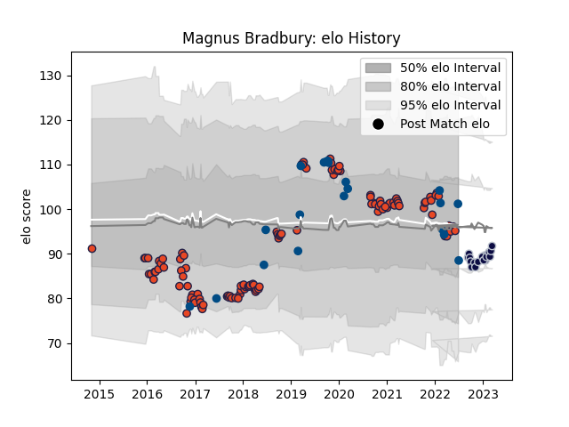

---  
layout: page  
title: Magnus Bradbury  
date: 2022-12-28 12:56:52.175085  
categories: player  
---
# Magnus Bradbury

## Positions: FL, N8

## Country: Scotland

## Current elo: 99.0

## Current Percentile: 50.0

# Elo History

# Match History

| Team          |   Appearances |   Win Rate |
|:--------------|--------------:|-----------:|
| Edinburgh     |           112 |   0.508929 |
| Scotland      |            20 |   0.625    |
| Bristol Rugby |             9 |   0.444444 |

| Opponent             |   Matches |   Win Rate |
|:---------------------|----------:|-----------:|
| Glasgow Warriors     |        10 |   0.4      |
| Cardiff Blues        |         9 |   0.333333 |
| Scarlets             |         8 |   0.75     |
| Dragons              |         8 |   0.75     |
| Leinster             |         8 |   0.25     |
| Munster              |         8 |   0.25     |
| Ulster               |         8 |   0.25     |
| Zebre                |         6 |   0.833333 |
| Connacht             |         6 |   0.5      |
| Benetton Treviso     |         6 |   0.666667 |
| Ospreys              |         6 |   0.166667 |
| London Irish         |         5 |   0.6      |
| Bordeaux Begles      |         3 |   0.166667 |
| England              |         3 |   0.5      |
| France               |         3 |   0.333333 |
| Argentina            |         3 |   0.666667 |
| Harlequins           |         3 |   1        |
| Italy                |         3 |   1        |
| Stade Francais Paris |         3 |   0.666667 |
| Saracens             |         2 |   0.5      |
| Stormers             |         2 |   0.25     |
| Southern Kings       |         2 |   1        |
| Cheetahs             |         2 |   0.5      |
| Wales                |         2 |   0        |
| Wasps                |         2 |   1        |
| Sale Sharks          |         1 |   0        |
| Timisoara Saracens   |         1 |   1        |
| Sharks               |         1 |   1        |
| Toulon               |         1 |   1        |
| Samoa                |         1 |   1        |
| Agen                 |         1 |   1        |
| Russia               |         1 |   1        |
| Pau                  |         1 |   1        |
| Northampton Saints   |         1 |   0        |
| Newcastle Falcons    |         1 |   0        |
| Montpellier Herault  |         1 |   0        |
| Krasny Yar           |         1 |   1        |
| Japan                |         1 |   0        |
| Georgia              |         1 |   1        |
| Exeter Chiefs        |         1 |   0        |
| Chile                |         1 |   1        |
| Canada               |         1 |   1        |
| Bulls                |         1 |   1        |
| Bath Rugby           |         1 |   1        |
| Lions                |         1 |   0        |