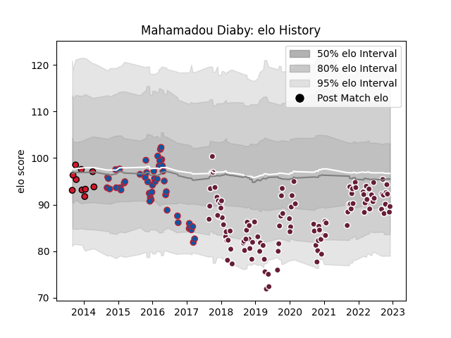

---  
layout: page  
title: Mahamadou Diaby  
date: 2022-12-18 16:22:15.921286  
categories: player  
---
# Mahamadou Diaby

## Positions: FL

## Current elo: 93.0

## Current Percentile: 24.0

# Elo History

# Match History

| Team            |   Appearances |   Win Rate |
|:----------------|--------------:|-----------:|
| Bordeaux Begles |           109 |   0.568807 |
| Grenoble        |            46 |   0.478261 |
| Oyonnax         |            10 |   0.5      |

| Opponent             |   Matches |   Win Rate |
|:---------------------|----------:|-----------:|
| Racing 92            |        13 |   0.384615 |
| Castres Olympique    |        13 |   0.615385 |
| Pau                  |        11 |   0.363636 |
| Montpellier Herault  |        11 |   0.454545 |
| Stade Toulousain     |        11 |   0.227273 |
| Stade Francais Paris |        11 |   0.727273 |
| Toulon               |        10 |   0.6      |
| Lyon                 |         9 |   0.666667 |
| Clermont Auvergne    |         9 |   0.555556 |
| La Rochelle          |         9 |   0.444444 |
| Agen                 |         8 |   1        |
| Brive                |         8 |   0.5625   |
| Perpignan            |         6 |   0.583333 |
| Oyonnax              |         5 |   0.6      |
| Edinburgh            |         4 |   0.75     |
| Bayonne              |         4 |   0.75     |
| Bordeaux Begles      |         4 |   0.25     |
| Rovigo               |         2 |   1        |
| Sale Sharks          |         2 |   0.5      |
| London Irish         |         2 |   0.5      |
| Grenoble             |         2 |   0.5      |
| Biarritz Olympique   |         2 |   0.5      |
| Worcester Warriors   |         2 |   0.25     |
| Newcastle Falcons    |         1 |   0        |
| Harlequins           |         1 |   0        |
| Gloucester Rugby     |         1 |   0        |
| Dragons              |         1 |   1        |
| Connacht             |         1 |   1        |
| Cardiff Blues        |         1 |   0        |
| Wasps                |         1 |   1        |