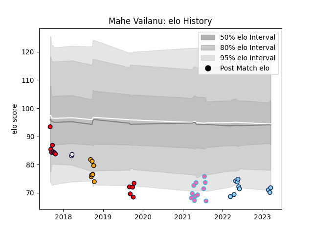

---  
layout: page  
title: Mahe Vailanu  
date: 2023-02-24 09:47:51.683443  
categories: player  
---
# Mahe Vailanu

## Positions: H, FL

## Current elo: 71.0

## Current Percentile: 6.0

# Elo History

# Match History

| Team                     |   Appearances |   Win Rate |
|:-------------------------|--------------:|-----------:|
| Melbourne Rising         |            13 |   0.153846 |
| L. A. Giltinis           |            11 |   0.909091 |
| NSW Country Eagles       |             7 |   0.142857 |
| New South Wales Waratahs |             7 |   0.571429 |
| Melbourne Rebels         |             2 |   0.5      |

| Opponent                 |   Matches |   Win Rate |
|:-------------------------|----------:|-----------:|
| Western Force            |         3 |   0.666667 |
| Brisbane City            |         3 |   0        |
| Canberra Vikings         |         3 |   0        |
| Utah Warriors            |         3 |   0.666667 |
| Fijian Drua              |         3 |   0        |
| Sydney Rays              |         3 |   0.666667 |
| NSW Country Eagles       |         2 |   0        |
| Queensland Country       |         2 |   0        |
| Old Glory DC             |         1 |   1        |
| Toronto Arrows           |         1 |   1        |
| Sharks                   |         1 |   1        |
| Seattle Seawolves        |         1 |   1        |
| San Diego Legion         |         1 |   1        |
| Rugby ATL                |         1 |   1        |
| Perth Spirit             |         1 |   0        |
| Austin Gilgronis         |         1 |   1        |
| New South Wales Waratahs |         1 |   0        |
| Blues                    |         1 |   0        |
| Melbourne Rising         |         1 |   0        |
| Hurricanes               |         1 |   0        |
| Houston SaberCats        |         1 |   1        |
| Highlanders              |         1 |   1        |
| Greater Sydney Rams      |         1 |   1        |
| Crusaders                |         1 |   1        |
| Chiefs                   |         1 |   0        |
| New England Free Jacks   |         1 |   1        |