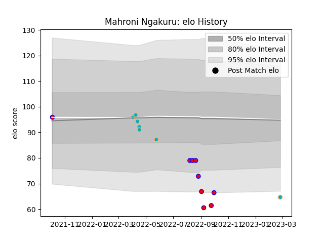

---  
layout: page  
title: Mahroni Ngakuru  
date: 2023-03-02 11:20:41.190062  
categories: player  
---
# Mahroni Ngakuru

## Positions: L

## Current elo: 65.0

## Current Percentile: 4.0

# Elo History

# Match History

| Team           |   Appearances |   Win Rate |
|:---------------|--------------:|-----------:|
| Tasman         |             9 |   0.444444 |
| Moana Pasifika |             7 |   0        |

| Opponent      |   Matches |   Win Rate |
|:--------------|----------:|-----------:|
| Chiefs        |         2 |          0 |
| Southland     |         2 |          1 |
| Blues         |         1 |          0 |
| Canterbury    |         1 |          0 |
| Fijian Drua   |         1 |          0 |
| Hawke's Bay   |         1 |          0 |
| Highlanders   |         1 |          0 |
| Hurricanes    |         1 |          0 |
| Manawatu      |         1 |          1 |
| North Harbour |         1 |          0 |
| Northland     |         1 |          1 |
| Otago         |         1 |          0 |
| Wellington    |         1 |          0 |
| Western Force |         1 |          0 |