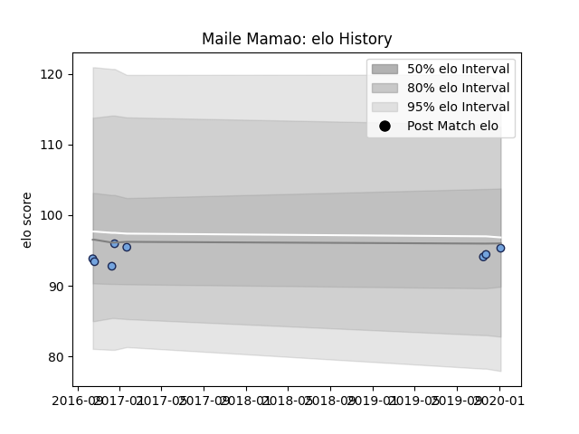

---  
layout: page  
title: Maile Mamao  
date: 2023-01-17 11:43:05.964610  
categories: player  
---
# Maile Mamao

## Positions: C

## Current elo: 81.0

## Current Percentile: 27.0

# Elo History

# Match History

| Team        |   Appearances |   Win Rate |
|:------------|--------------:|-----------:|
| Tarbes      |            34 |   0.514706 |
| US Bressane |            13 |   0.692308 |
| Bayonne     |             4 |   0.5      |

| Opponent                   |   Matches |   Win Rate |
|:---------------------------|----------:|-----------:|
| Dax                        |         7 |   0.285714 |
| Bourgoin-Jallieu           |         5 |   0.8      |
| Chambery                   |         5 |   0.4      |
| Nice                       |         5 |   0.3      |
| Narbonne                   |         4 |   0.25     |
| Suresnes                   |         4 |   0.5      |
| Blagnac                    |         3 |   0.666667 |
| Cognac Saint Jean d'Angély |         3 |   1        |
| Aubenas                    |         3 |   0.666667 |
| Valence Romans Drome Rugby |         2 |   1        |
| Massy                      |         2 |   0.5      |
| Soyaux-Angouleme           |         1 |   1        |
| US Bressane                |         1 |   1        |
| Tarbes                     |         1 |   1        |
| Albi                       |         1 |   1        |
| Rennes                     |         1 |   1        |
| Carqueiranne-Hyères        |         1 |   1        |
| Beziers                    |         1 |   0        |
| Dijon                      |         1 |   0        |