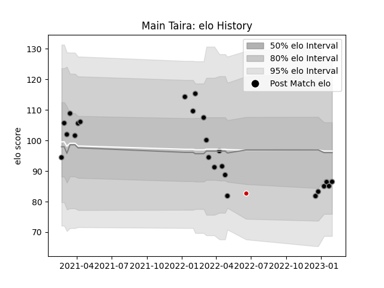

---  
layout: page  
title: Main Taira  
date: 2022-12-18 16:29:33.296914  
categories: player  
---
# Main Taira

## Positions: FB, C

## Current elo: 88.0

## Current Percentile: 33.0

# Elo History

# Match History

| Team             |   Appearances |   Win Rate |
|:-----------------|--------------:|-----------:|
| Black Rams Tokyo |            16 |       0.25 |

| Opponent                        |   Matches |   Win Rate |
|:--------------------------------|----------:|-----------:|
| Green Rockets Tokatsu           |         2 |        1   |
| Kobelco Kobe Steelers           |         2 |        0   |
| NTT Docomo Red Hurricanes Osaka |         2 |        0.5 |
| Shizuoka Blue Revs              |         2 |        0.5 |
| Tokyo Sungoliath                |         2 |        0   |
| Toyota Verblitz                 |         2 |        0   |
| Yokohama Canon Eagles           |         2 |        0   |
| Mitsubishi Dynaboars            |         1 |        0   |
| Toshiba Brave Lupus Tokyo       |         1 |        0   |