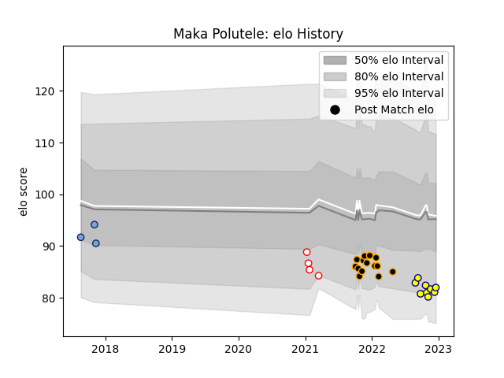

---  
layout: page  
title: Maka Polutele  
date: 2023-01-13 11:29:29.338844  
categories: player  
---
# Maka Polutele

## Positions: L, N8

## Current elo: 50.0

## Current Percentile: 0.0

# Elo History

# Match History

| Team     |   Appearances |   Win Rate |
|:---------|--------------:|-----------:|
| Chambery |            20 |   0.4      |
| Dax      |            13 |   0.461538 |
| Nevers   |            10 |   0.4      |
| Bayonne  |             6 |   0.166667 |

| Opponent                   |   Matches |   Win Rate |
|:---------------------------|----------:|-----------:|
| Massy                      |         5 |   0.4      |
| Blagnac                    |         4 |   0.5      |
| Albi                       |         4 |   0        |
| Dijon                      |         3 |   1        |
| Tarbes                     |         3 |   0.666667 |
| Suresnes                   |         3 |   0.666667 |
| Narbonne                   |         2 |   0        |
| Montauban                  |         2 |   0        |
| Grenoble                   |         2 |   0        |
| Cognac Saint Jean d'Angély |         2 |   0.5      |
| Soyaux-Angouleme           |         2 |   1        |
| Bourgoin-Jallieu           |         2 |   0.5      |
| Valence Romans Drome Rugby |         2 |   0        |
| Nice                       |         2 |   0.5      |
| Provence Rugby             |         1 |   1        |
| Oyonnax                    |         1 |   0        |
| Perpignan                  |         1 |   0        |
| Agen                       |         1 |   1        |
| Mont-de-Marsan             |         1 |   0        |
| Dax                        |         1 |   0        |
| Chambery                   |         1 |   1        |
| Carcassonne                |         1 |   0        |
| Aurillac                   |         1 |   0        |
| Aubenas                    |         1 |   0        |
| Vannes                     |         1 |   0        |