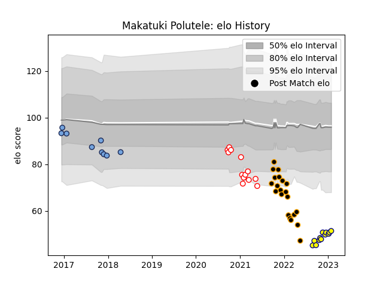

---  
layout: page  
title: Makatuki Polutele  
date: 2023-02-03 18:20:01.699088  
categories: player  
---
# Makatuki Polutele

## Positions: N8, L

## Current elo: 51.0

## Current Percentile: 0.0

# Elo History

# Match History

| Team     |   Appearances |   Win Rate |
|:---------|--------------:|-----------:|
| Chambery |            21 |   0.380952 |
| Dax      |            13 |   0.461538 |
| Nevers   |            12 |   0.416667 |
| Bayonne  |             9 |   0.111111 |

| Opponent                   |   Matches |   Win Rate |
|:---------------------------|----------:|-----------:|
| Albi                       |         5 |   0        |
| Massy                      |         5 |   0.4      |
| Blagnac                    |         4 |   0.5      |
| Tarbes                     |         3 |   0.666667 |
| Suresnes                   |         3 |   0.666667 |
| Dijon                      |         3 |   1        |
| Grenoble                   |         2 |   0        |
| Valence Romans Drome Rugby |         2 |   0        |
| Soyaux-Angouleme           |         2 |   1        |
| Oyonnax                    |         2 |   0        |
| Nice                       |         2 |   0.5      |
| Narbonne                   |         2 |   0        |
| Montauban                  |         2 |   0        |
| Vannes                     |         2 |   0.5      |
| Cognac Saint Jean d'Angély |         2 |   0.5      |
| Bourgoin-Jallieu           |         2 |   0.5      |
| Benetton Treviso           |         2 |   0        |
| Gloucester Rugby           |         1 |   0        |
| Mont-de-Marsan             |         1 |   0        |
| Dax                        |         1 |   0        |
| Chambery                   |         1 |   1        |
| Carcassonne                |         1 |   0        |
| Perpignan                  |         1 |   0        |
| Provence Rugby             |         1 |   1        |
| Aurillac                   |         1 |   0        |
| Aubenas                    |         1 |   0        |
| Agen                       |         1 |   1        |