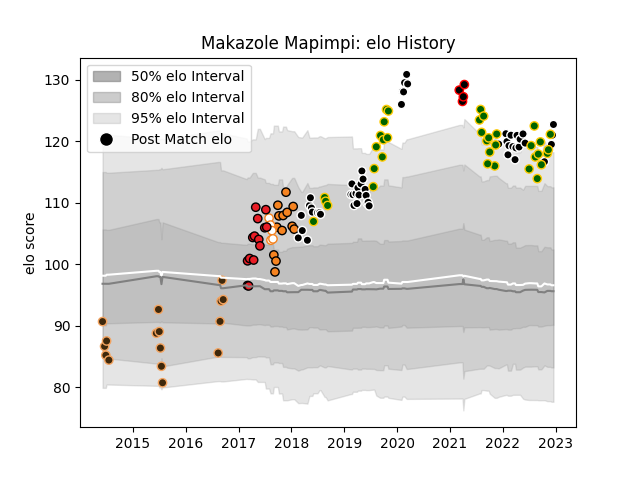

---  
layout: page  
title: Makazole Mapimpi  
date: 2022-12-09 13:12:29.821492  
categories: player  
---
# Makazole Mapimpi

## Positions: W

## Country: South Africa

## Current elo: 119.0

## Current Percentile: 95.0

# Elo History

# Match History

| Team                            |   Appearances |   Win Rate |
|:--------------------------------|--------------:|-----------:|
| Sharks                          |            49 |   0.612245 |
| South Africa                    |            36 |   0.625    |
| Border Bulldogs                 |            16 |   0.375    |
| Southern Kings                  |            14 |   0.428571 |
| Cheetahs                        |            13 |   0.615385 |
| Free State Cheetahs             |             5 |   0.8      |
| NTT Docomo Red Hurricanes Osaka |             4 |   0.5      |

| Opponent                 |   Matches |   Win Rate |
|:-------------------------|----------:|-----------:|
| Bulls                    |         8 |   0.5      |
| Stormers                 |         7 |   0.5      |
| Lions                    |         7 |   0.714286 |
| Jaguares                 |         7 |   0.428571 |
| Argentina                |         6 |   0.833333 |
| New Zealand              |         6 |   0.416667 |
| Australia                |         6 |   0.333333 |
| Wales                    |         5 |   0.8      |
| British and Irish Lions  |         3 |   0.666667 |
| Brumbies                 |         3 |   0        |
| Griquas                  |         3 |   0.333333 |
| Leopards                 |         3 |   0        |
| Melbourne Rebels         |         3 |   1        |
| England                  |         3 |   0.666667 |
| Valke                    |         3 |   0.333333 |
| SWD Eagles               |         3 |   0.333333 |
| Sunwolves                |         3 |   1        |
| Ospreys                  |         2 |   1        |
| New South Wales Waratahs |         2 |   1        |
| Ulster                   |         2 |   0        |
| Sharks                   |         2 |   0.5      |
| Southern Kings           |         2 |   1        |
| Leinster                 |         2 |   1        |
| Scarlets                 |         2 |   1        |
| Japan                    |         2 |   1        |
| Zebre                    |         2 |   1        |
| Benetton Treviso         |         2 |   0.5      |
| Crusaders                |         2 |   0.25     |
| Chiefs                   |         2 |   0.5      |
| Edinburgh                |         2 |   0.5      |
| Boland Cavaliers         |         2 |   0.5      |
| Glasgow Warriors         |         2 |   0.5      |
| Connacht                 |         2 |   0.5      |
| Griffons                 |         2 |   0.5      |
| Highlanders              |         2 |   1        |
| Hurricanes               |         2 |   0        |
| Scotland                 |         1 |   1        |
| Blue Bulls               |         1 |   1        |
| Blues                    |         1 |   1        |
| Western Force            |         1 |   0        |
| Cheetahs                 |         1 |   0        |
| Shizuoka Blue Revs       |         1 |   0        |
| Western Province         |         1 |   1        |
| Black Rams Tokyo         |         1 |   1        |
| Ireland                  |         1 |   0        |
| Queensland Reds          |         1 |   0        |
| Italy                    |         1 |   1        |
| Dragons                  |         1 |   1        |
| France                   |         1 |   0        |
| Namibia Welwitchias      |         1 |   1        |
| Namibia                  |         1 |   1        |
| Munster                  |         1 |   0        |
| Golden Lions             |         1 |   1        |
| Kobelco Kobe Steelers    |         1 |   0        |
| Hino Red Dolphins        |         1 |   1        |
| Pumas                    |         1 |   1        |