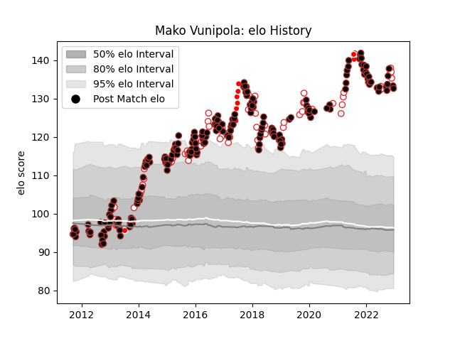

---  
layout: page  
title: Mako Vunipola  
date: 2022-12-14 11:12:35.147352  
categories: player  
---
# Mako Vunipola

## Positions: P

## Country: England

## Current elo: 133.0

## Current Percentile: 99.0

# Elo History

# Match History

| Team                    |   Appearances |   Win Rate |
|:------------------------|--------------:|-----------:|
| Saracens                |           203 |   0.805419 |
| England                 |            65 |   0.730769 |
| British and Irish Lions |            10 |   0.55     |

| Opponent            |   Matches |   Win Rate |
|:--------------------|----------:|-----------:|
| Harlequins          |        17 |   0.764706 |
| Northampton Saints  |        16 |   0.8125   |
| Exeter Chiefs       |        15 |   0.533333 |
| Bath Rugby          |        14 |   0.928571 |
| Sale Sharks         |        13 |   0.846154 |
| Australia           |        12 |   0.75     |
| Wasps               |        12 |   0.916667 |
| Leicester Tigers    |        11 |   0.863636 |
| Worcester Warriors  |        10 |   1        |
| Newcastle Falcons   |        10 |   1        |
| Gloucester Rugby    |        10 |   0.6      |
| Ireland             |         9 |   0.555556 |
| London Irish        |         9 |   0.833333 |
| France              |         8 |   0.75     |
| South Africa        |         8 |   0.25     |
| Italy               |         8 |   1        |
| Scotland            |         7 |   0.857143 |
| Wales               |         7 |   0.571429 |
| Clermont Auvergne   |         7 |   0.285714 |
| Racing 92           |         6 |   0.833333 |
| Munster             |         6 |   0.833333 |
| Bristol Rugby       |         5 |   0.8      |
| New Zealand         |         5 |   0.6      |
| Ulster              |         4 |   1        |
| Stade Toulousain    |         4 |   0.5      |
| Edinburgh           |         4 |   0.75     |
| Argentina           |         4 |   0.75     |
| London Welsh        |         3 |   1        |
| Leinster            |         3 |   0.666667 |
| Toulon              |         3 |   0.333333 |
| Glasgow Warriors    |         3 |   1        |
| Ospreys             |         3 |   0.833333 |
| Connacht            |         2 |   1        |
| Cardiff Blues       |         2 |   1        |
| Fiji                |         2 |   1        |
| Oyonnax             |         2 |   1        |
| Uruguay             |         1 |   1        |
| Scarlets            |         1 |   1        |
| Ampthill            |         1 |   1        |
| Provincial Union XV |         1 |   1        |
| Nottingham          |         1 |   1        |
| New Zealand Maori   |         1 |   1        |
| Lyon                |         1 |   1        |
| Japan               |         1 |   1        |
| Ealing Trailfinders |         1 |   1        |
| Doncaster           |         1 |   1        |
| Crusaders           |         1 |   1        |
| Coventry            |         1 |   1        |
| Bedford             |         1 |   1        |
| Zebre               |         1 |   1        |