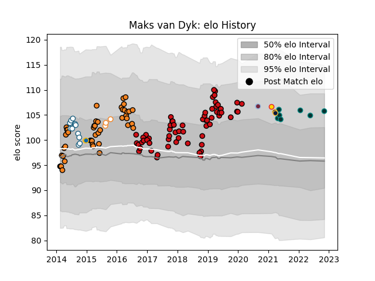

---  
layout: page  
title: Maks van Dyk  
date: 2022-11-15 23:43:13.231743  
categories: player  
---
# Maks van Dyk

## Positions: P

## Current elo: 106.0

## Current Percentile: 84.0

# Elo History

# Match History

| Team                |   Appearances |   Win Rate |
|:--------------------|--------------:|-----------:|
| Stade Toulousain    |            63 |   0.65873  |
| Cheetahs            |            45 |   0.277778 |
| Griquas             |            12 |   0.5      |
| Pau                 |             7 |   0.285714 |
| Free State Cheetahs |             3 |   0.333333 |
| Harlequins          |             2 |   0.5      |
| Leinster            |             2 |   0.5      |
| Worcester Warriors  |             2 |   0        |
| Exeter Chiefs       |             1 |   1        |

| Opponent                 |   Matches |   Win Rate |
|:-------------------------|----------:|-----------:|
| Clermont Auvergne        |         7 |   0.642857 |
| Stormers                 |         6 |   0.333333 |
| Bordeaux Begles          |         6 |   1        |
| Bulls                    |         6 |   0.333333 |
| Montpellier Herault      |         6 |   0.5      |
| Stade Francais Paris     |         5 |   0.8      |
| Lyon                     |         5 |   0.4      |
| La Rochelle              |         5 |   0.4      |
| Agen                     |         4 |   1        |
| Toulon                   |         4 |   0.125    |
| Sharks                   |         4 |   0.25     |
| Racing 92                |         4 |   0.5      |
| Pau                      |         4 |   0.75     |
| Lions                    |         4 |   0        |
| Queensland Reds          |         3 |   0        |
| Brive                    |         3 |   0.333333 |
| Brumbies                 |         3 |   0.333333 |
| Western Force            |         3 |   0.666667 |
| Perpignan                |         2 |   1        |
| Northampton Saints       |         2 |   0.5      |
| Crusaders                |         2 |   0        |
| New South Wales Waratahs |         2 |   0        |
| Sale Sharks              |         2 |   0.75     |
| Cardiff Blues            |         2 |   0        |
| Melbourne Rebels         |         2 |   0        |
| Bath Rugby               |         2 |   0.5      |
| Connacht                 |         2 |   1        |
| Leinster                 |         2 |   0.5      |
| Chiefs                   |         2 |   0.25     |
| Sunwolves                |         2 |   1        |
| Bayonne                  |         2 |   0.5      |
| Wasps                    |         2 |   1        |
| Golden Lions             |         2 |   0        |
| Western Province         |         2 |   0        |
| Blues                    |         2 |   0.5      |
| Southern Kings           |         1 |   1        |
| Blue Bulls               |         1 |   0        |
| Boland Cavaliers         |         1 |   1        |
| Valke                    |         1 |   1        |
| Worcester Warriors       |         1 |   0        |
| SWD Eagles               |         1 |   1        |
| Newcastle Falcons        |         1 |   1        |
| Pumas                    |         1 |   0        |
| Natal Sharks             |         1 |   0        |
| Munster                  |         1 |   0        |
| Castres Olympique        |         1 |   0        |
| Leopards                 |         1 |   1        |
| Jaguares                 |         1 |   0        |
| Hurricanes               |         1 |   0        |
| Highlanders              |         1 |   0        |
| Griquas                  |         1 |   1        |
| Griffons                 |         1 |   1        |
| Grenoble                 |         1 |   1        |
| Free State Cheetahs      |         1 |   0        |
| Eastern Province Kings   |         1 |   1        |
| Zebre                    |         1 |   1        |