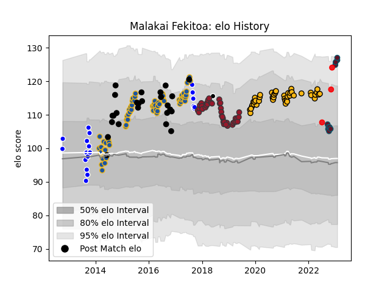

---  
layout: page  
title: Malakai Fekitoa  
date: 2023-01-06 00:08:27.386862  
categories: player  
---
# Malakai Fekitoa

## Positions: C

## Country: Tonga

## Current elo: 132.0

## Current Percentile: 95.0

# Elo History

# Match History

| Team        |   Appearances |   Win Rate |
|:------------|--------------:|-----------:|
| Highlanders |            65 |   0.676923 |
| Wasps       |            44 |   0.534091 |
| Toulon      |            39 |   0.397436 |
| New Zealand |            25 |   0.84     |
| Auckland    |            19 |   0.578947 |
| Munster     |             7 |   0.428571 |
| Tonga       |             3 |   0.666667 |
| Barbarians  |             1 |   1        |

| Opponent                 |   Matches |   Win Rate |
|:-------------------------|----------:|-----------:|
| Australia                |         8 |   0.8125   |
| Crusaders                |         8 |   0.25     |
| Chiefs                   |         8 |   0.75     |
| Hurricanes               |         7 |   0.571429 |
| Blues                    |         6 |   0.666667 |
| Bristol Rugby            |         5 |   0.8      |
| New South Wales Waratahs |         5 |   0.8      |
| Agen                     |         4 |   0.75     |
| Queensland Reds          |         4 |   0.5      |
| Leicester Tigers         |         4 |   0.25     |
| Gloucester Rugby         |         4 |   0.5      |
| Lions                    |         4 |   0.5      |
| Lyon                     |         4 |   0.375    |
| Harlequins               |         4 |   0.25     |
| Bordeaux Begles          |         4 |   0.25     |
| Western Force            |         4 |   0.75     |
| Pau                      |         3 |   0.333333 |
| Racing 92                |         3 |   0        |
| Sale Sharks              |         3 |   0        |
| Northampton Saints       |         3 |   0.333333 |
| North Harbour            |         3 |   0.666667 |
| Newcastle Falcons        |         3 |   0.666667 |
| Sharks                   |         3 |   0.666667 |
| South Africa             |         3 |   0.666667 |
| Montpellier Herault      |         3 |   0.333333 |
| Melbourne Rebels         |         3 |   1        |
| Stormers                 |         3 |   0.666667 |
| Argentina                |         3 |   1        |
| Worcester Warriors       |         3 |   1        |
| Otago                    |         3 |   0.333333 |
| London Irish             |         3 |   0.5      |
| Clermont Auvergne        |         3 |   0.666667 |
| Bath Rugby               |         3 |   1        |
| Brumbies                 |         3 |   1        |
| Bulls                    |         3 |   1        |
| Exeter Chiefs            |         3 |   0.666667 |
| Castres Olympique        |         3 |   0.666667 |
| England                  |         3 |   1        |
| Edinburgh                |         3 |   0        |
| Perpignan                |         2 |   1        |
| Cheetahs                 |         2 |   1        |
| Oyonnax                  |         2 |   0.5      |
| Ireland                  |         2 |   0.5      |
| British and Irish Lions  |         2 |   0.75     |
| Northland                |         2 |   1        |
| Saracens                 |         2 |   1        |
| Stade Toulousain         |         2 |   0.5      |
| Canterbury               |         2 |   0.5      |
| Counties Manukau         |         2 |   0.5      |
| Taranaki                 |         2 |   0.5      |
| Ulster                   |         2 |   0.5      |
| Wales                    |         2 |   1        |
| La Rochelle              |         2 |   0        |
| Stade Francais Paris     |         2 |   0.5      |
| Sunwolves                |         1 |   1        |
| Spain                    |         1 |   1        |
| Uruguay                  |         1 |   1        |
| Waikato                  |         1 |   0        |
| Wellington               |         1 |   0        |
| Bay of Plenty            |         1 |   1        |
| Cardiff Blues            |         1 |   0        |
| Southland                |         1 |   1        |
| Brive                    |         1 |   0        |
| Scotland                 |         1 |   1        |
| Italy                    |         1 |   1        |
| Connacht                 |         1 |   0        |
| Dragons                  |         1 |   0        |
| Namibia                  |         1 |   1        |
| Munster                  |         1 |   0        |
| Manawatu                 |         1 |   1        |
| Fiji                     |         1 |   0        |
| Georgia                  |         1 |   1        |
| Grenoble                 |         1 |   0        |
| Jaguares                 |         1 |   1        |
| Zebre                    |         1 |   1        |