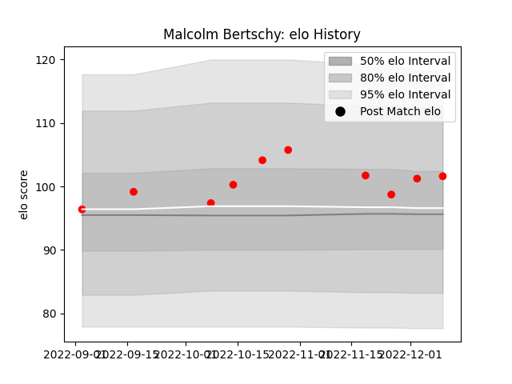

---  
layout: page  
title: Malcolm Bertschy  
date: 2022-12-18 16:19:27.014042  
categories: player  
---
# Malcolm Bertschy

## Positions: W

## Current elo: 102.0

## Current Percentile: 71.0

# Elo History

# Match History

| Team   |   Appearances |   Win Rate |
|:-------|--------------:|-----------:|
| Rouen  |            10 |        0.5 |

| Opponent           |   Matches |   Win Rate |
|:-------------------|----------:|-----------:|
| Beziers            |         1 |          0 |
| Biarritz Olympique |         1 |          1 |
| Carcassonne        |         1 |          0 |
| Colomiers          |         1 |          1 |
| Grenoble           |         1 |          0 |
| Mont-de-Marsan     |         1 |          1 |
| Montauban          |         1 |          1 |
| Nevers             |         1 |          0 |
| Provence Rugby     |         1 |          0 |
| Soyaux-Angouleme   |         1 |          1 |