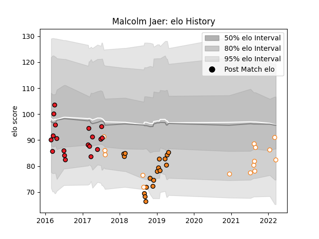

---  
layout: page  
title: Malcolm Jaer  
date: 2023-03-17 17:20:59.144114  
categories: player  
---
# Malcolm Jaer

## Positions: FB, W

## Current elo: 82.0

## Current Percentile: 37.0

# Elo History

# Match History

| Team                |   Appearances |   Win Rate |
|:--------------------|--------------:|-----------:|
| Southern Kings      |            19 |   0.210526 |
| Cheetahs            |            18 |   0.472222 |
| Free State Cheetahs |            15 |   0.5      |

| Opponent         |   Matches |   Win Rate |
|:-----------------|----------:|-----------:|
| Lions            |         4 |   0        |
| Western Province |         3 |   0.666667 |
| Southern Kings   |         3 |   1        |
| Pumas            |         3 |   0.666667 |
| Ospreys          |         3 |   0        |
| Glasgow Warriors |         3 |   0        |
| Golden Lions     |         3 |   0.5      |
| Griquas          |         3 |   0.666667 |
| Jaguares         |         2 |   0.5      |
| Blue Bulls       |         2 |   0        |
| Sunwolves        |         2 |   1        |
| Stormers         |         2 |   0        |
| Zebre            |         2 |   1        |
| Cardiff Blues    |         2 |   0.5      |
| Bulls            |         2 |   0.5      |
| Hurricanes       |         1 |   0        |
| Highlanders      |         1 |   0        |
| Dragons          |         1 |   1        |
| Munster          |         1 |   0        |
| Natal Sharks     |         1 |   0        |
| Crusaders        |         1 |   0        |
| Connacht         |         1 |   0        |
| Sharks           |         1 |   0        |
| Chiefs           |         1 |   0        |
| Cheetahs         |         1 |   0        |
| Ulster           |         1 |   0.5      |
| Western Force    |         1 |   0        |
| Benetton Treviso |         1 |   1        |