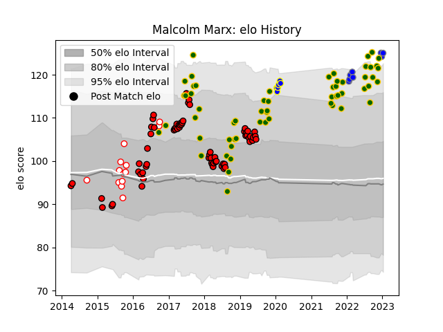

---  
layout: page  
title: Malcolm Marx  
date: 2022-11-22 11:39:03.189839  
categories: player  
---
# Malcolm Marx

## Positions: H

## Country: South Africa

## Current elo: 125.0

## Current Percentile: 98.0

# Elo History

# Match History

| Team                              |   Appearances |   Win Rate |
|:----------------------------------|--------------:|-----------:|
| Lions                             |            68 |   0.683824 |
| South Africa                      |            58 |   0.594828 |
| Golden Lions                      |            10 |   1        |
| Urayasu D-Rocks                   |             6 |   0.666667 |
| Kubota Spears Funabashi Tokyo-Bay |             4 |   1        |

| Opponent                          |   Matches |   Win Rate |
|:----------------------------------|----------:|-----------:|
| New Zealand                       |        11 |   0.318182 |
| Argentina                         |         9 |   0.888889 |
| Sharks                            |         9 |   0.666667 |
| Australia                         |         8 |   0.375    |
| Wales                             |         8 |   0.5      |
| Jaguares                          |         8 |   0.75     |
| Stormers                          |         7 |   0.642857 |
| Bulls                             |         6 |   0.666667 |
| Crusaders                         |         6 |   0.166667 |
| France                            |         6 |   0.833333 |
| Hurricanes                        |         5 |   0.2      |
| New South Wales Waratahs          |         5 |   1        |
| Sunwolves                         |         4 |   1        |
| Western Province                  |         3 |   1        |
| Eastern Province Kings            |         3 |   1        |
| England                           |         3 |   0.333333 |
| Southern Kings                    |         3 |   1        |
| British and Irish Lions           |         3 |   0.666667 |
| Japan                             |         2 |   1        |
| Blues                             |         2 |   0.5      |
| Scotland                          |         2 |   1        |
| Queensland Reds                   |         2 |   0.5      |
| Melbourne Rebels                  |         2 |   1        |
| Brumbies                          |         2 |   0.5      |
| Cheetahs                          |         2 |   1        |
| Italy                             |         2 |   1        |
| Ireland                           |         2 |   0        |
| Chiefs                            |         2 |   1        |
| Highlanders                       |         2 |   1        |
| Free State Cheetahs               |         2 |   1        |
| Georgia                           |         1 |   1        |
| Western Force                     |         1 |   1        |
| Black Rams Tokyo                  |         1 |   1        |
| Toyota Verblitz                   |         1 |   1        |
| Tokyo Sungoliath                  |         1 |   0        |
| Green Rockets Tokatsu             |         1 |   1        |
| Shizuoka Blue Revs                |         1 |   1        |
| Kubota Spears Funabashi Tokyo-Bay |         1 |   0        |
| Hino Red Dolphins                 |         1 |   1        |
| Pumas                             |         1 |   1        |
| Natal Sharks                      |         1 |   1        |
| Munakata Sanix Blues              |         1 |   1        |
| Mie Honda Heat                    |         1 |   1        |
| Canada                            |         1 |   1        |
| Yokohama Canon Eagles             |         1 |   1        |