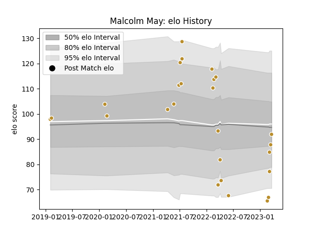

---  
layout: page  
title: Malcolm May  
date: 2023-03-17 17:40:51.056706  
categories: player  
---
# Malcolm May

## Positions: FL, L

## Current elo: 88.0

## Current Percentile: 6.0

# Elo History

# Match History

| Team      |   Appearances |   Win Rate |
|:----------|--------------:|-----------:|
| NOLA Gold |            25 |       0.44 |

| Opponent               |   Matches |   Win Rate |
|:-----------------------|----------:|-----------:|
| New England Free Jacks |         5 |   0.2      |
| Rugby ATL              |         4 |   0        |
| Rugby New York         |         3 |   0.666667 |
| Seattle Seawolves      |         3 |   0.666667 |
| R.U. New York          |         2 |   0.5      |
| Austin Gilgronis       |         1 |   0        |
| Colorado Raptors       |         1 |   1        |
| Glendale Raptors       |         1 |   1        |
| Houston SaberCats      |         1 |   0        |
| L. A. Giltinis         |         1 |   1        |
| Old Glory DC           |         1 |   1        |
| Toronto Arrows         |         1 |   0        |
| Utah Warriors          |         1 |   1        |