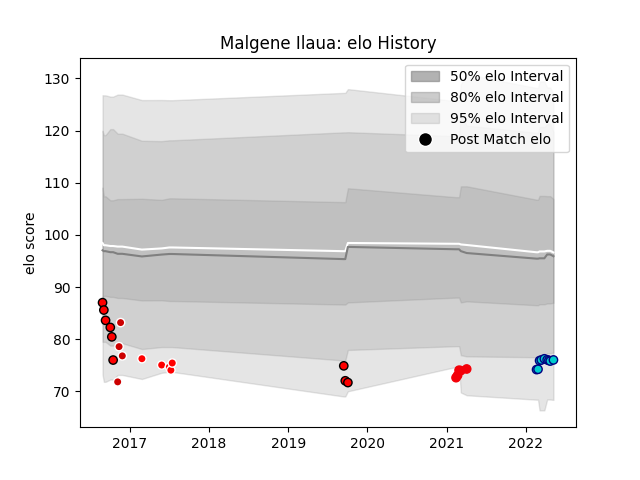

---  
layout: page  
title: Malgene Ilaua  
date: 2023-03-21 18:09:23.958603  
categories: player  
---
# Malgene Ilaua

Last updated: 2023-03-21
## Positions: FL

## Country: Japan

## Current elo: 76.0

## Current Percentile: 9.0

# Elo History

# Match History

| Team                      |   Appearances |   Win Rate |
|:--------------------------|--------------:|-----------:|
| Shizuoka Blue Revs        |             9 |   0.333333 |
| Toshiba Brave Lupus Tokyo |             6 |   0.666667 |
| Coca-Cola Red Sparks      |             5 |   0.8      |
| Sunwolves                 |             5 |   0.2      |
| Japan                     |             4 |   0.25     |
| Counties Manukau          |             3 |   0        |

| Opponent                          |   Matches |   Win Rate |
|:----------------------------------|----------:|-----------:|
| Yokohama Canon Eagles             |         2 |        0.5 |
| Toyota Industries Shuttles Aichi  |         2 |        0   |
| Green Rockets Tokatsu             |         2 |        1   |
| Kubota Spears Funabashi Tokyo-Bay |         2 |        0.5 |
| Munakata Sanix Blues              |         1 |        0   |
| Wales                             |         1 |        0   |
| Urayasu D-Rocks                   |         1 |        1   |
| Toyota Verblitz                   |         1 |        0   |
| Toshiba Brave Lupus Tokyo         |         1 |        0   |
| Tokyo Sungoliath                  |         1 |        0   |
| Stormers                          |         1 |        0   |
| Southland                         |         1 |        0   |
| Skyactivs Hiroshima               |         1 |        1   |
| Shimizu Blue Sharks               |         1 |        1   |
| Saitama Wild Knights              |         1 |        0   |
| Argentina                         |         1 |        0   |
| Auckland                          |         1 |        0   |
| Lions                             |         1 |        0   |
| Kyuden Voltex                     |         1 |        1   |
| Hurricanes                        |         1 |        0   |
| Hawke's Bay                       |         1 |        0   |
| Georgia                           |         1 |        1   |
| Fiji                              |         1 |        0   |
| Chugoku Red Regulions             |         1 |        1   |
| Cheetahs                          |         1 |        0   |
| Blues                             |         1 |        1   |
| Black Rams Tokyo                  |         1 |        1   |
| Mie Honda Heat                    |         1 |        1   |