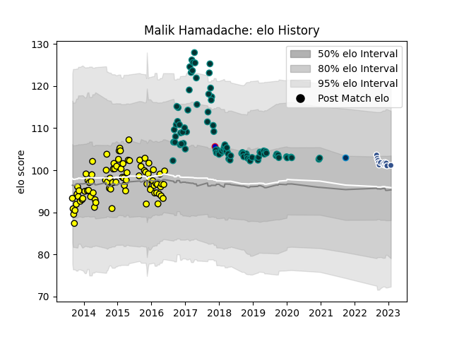

---  
layout: page  
title: Malik Hamadache  
date: 2022-12-14 11:15:44.999205  
categories: player  
---
# Malik Hamadache

## Positions: P

## Country: France

## Current elo: 94.0

## Current Percentile: 51.0

# Elo History

# Match History

| Team                |   Appearances |   Win Rate |
|:--------------------|--------------:|-----------:|
| Pau                 |            83 |   0.439759 |
| Albi                |            43 |   0.488372 |
| Agen                |            11 |   0.363636 |
| France              |             1 |   0        |
| Montpellier Herault |             1 |   0        |

| Opponent             |   Matches |   Win Rate |
|:---------------------|----------:|-----------:|
| Stade Francais Paris |         8 |   0.5      |
| Castres Olympique    |         7 |   0.428571 |
| Racing 92            |         7 |   0.428571 |
| Lyon                 |         7 |   0.285714 |
| Clermont Auvergne    |         7 |   0.285714 |
| La Rochelle          |         6 |   0.166667 |
| Toulon               |         6 |   0.333333 |
| Stade Toulousain     |         5 |   0.2      |
| Montpellier Herault  |         5 |   0.2      |
| Grenoble             |         5 |   0.8      |
| Colomiers            |         5 |   0.6      |
| Agen                 |         5 |   0.8      |
| Bordeaux Begles      |         5 |   0.4      |
| Mont-de-Marsan       |         4 |   0        |
| Aurillac             |         4 |   0.75     |
| Bayonne              |         4 |   0.375    |
| Tarbes               |         4 |   0.25     |
| Carcassonne          |         4 |   0.5      |
| Montauban            |         3 |   0        |
| Provence Rugby       |         3 |   0.666667 |
| Pau                  |         3 |   0.333333 |
| Oyonnax              |         3 |   0.666667 |
| Beziers              |         3 |   0.166667 |
| Bourgoin-Jallieu     |         3 |   1        |
| Dax                  |         3 |   0.833333 |
| Brive                |         3 |   0.666667 |
| Massy                |         2 |   1        |
| Gloucester Rugby     |         2 |   1        |
| Perpignan            |         2 |   0.5      |
| Cardiff Blues        |         2 |   0        |
| Soyaux-Angouleme     |         1 |   0        |
| Bath Rugby           |         1 |   0        |
| Narbonne             |         1 |   0        |
| Rouen                |         1 |   1        |
| New Zealand          |         1 |   0        |
| Biarritz Olympique   |         1 |   1        |
| Auch                 |         1 |   1        |
| Bristol Rugby        |         1 |   0        |
| Worcester Warriors   |         1 |   1        |