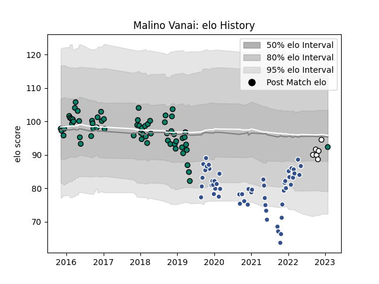

---  
layout: page  
title: Malino Vanai  
date: 2023-02-02 19:11:30.336687  
categories: player  
---
# Malino Vanai

## Positions: P

## Current elo: 92.0

## Current Percentile: 26.0

# Elo History

# Match History

| Team      |   Appearances |   Win Rate |
|:----------|--------------:|-----------:|
| Montauban |            64 |   0.46875  |
| Agen      |            53 |   0.245283 |
| Brive     |             6 |   0.166667 |

| Opponent             |   Matches |   Win Rate |
|:---------------------|----------:|-----------:|
| Bayonne              |         9 |   0.388889 |
| Vannes               |         6 |   0.666667 |
| Colomiers            |         6 |   0.5      |
| Mont-de-Marsan       |         5 |   0.2      |
| Brive                |         5 |   0.6      |
| Narbonne             |         5 |   0.6      |
| Soyaux-Angouleme     |         5 |   0.6      |
| Nevers               |         5 |   0.6      |
| Biarritz Olympique   |         5 |   0.4      |
| Beziers              |         5 |   0.1      |
| Aurillac             |         5 |   0.4      |
| Bordeaux Begles      |         4 |   0        |
| Dax                  |         4 |   0.5      |
| Pau                  |         4 |   0        |
| Lyon                 |         4 |   0        |
| Provence Rugby       |         3 |   0.666667 |
| Perpignan            |         3 |   0.666667 |
| Oyonnax              |         3 |   0.166667 |
| Racing 92            |         3 |   0.166667 |
| La Rochelle          |         3 |   0        |
| Toulon               |         3 |   0        |
| Massy                |         3 |   0.666667 |
| US Bressane          |         3 |   0        |
| Castres Olympique    |         3 |   0        |
| Albi                 |         2 |   1        |
| Stade Toulousain     |         2 |   0        |
| Clermont Auvergne    |         2 |   0        |
| Rouen                |         2 |   0.5      |
| Carcassonne          |         2 |   0.5      |
| Stade Francais Paris |         2 |   0.5      |
| Tarbes               |         1 |   0        |
| Agen                 |         1 |   0        |
| Montpellier Herault  |         1 |   1        |
| Montauban            |         1 |   1        |
| Grenoble             |         1 |   0        |
| Edinburgh            |         1 |   0        |
| Wasps                |         1 |   0        |