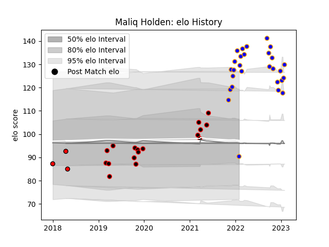

---  
layout: page  
title: Maliq Holden  
date: 2022-12-18 16:31:31.964183  
categories: player  
---
# Maliq Holden

## Positions: W, FB

## Current elo: 111.0

## Current Percentile: 92.0

# Elo History

# Match History

| Team             |   Appearances |   Win Rate |
|:-----------------|--------------:|-----------:|
| Doncaster        |            22 |   0.772727 |
| Cornish Pirates  |            14 |   0.5      |
| Hartpury College |             2 |   0.5      |

| Opponent            |   Matches |   Win Rate |
|:--------------------|----------:|-----------:|
| Bedford             |         4 |       0.75 |
| Ealing Trailfinders |         4 |       0.75 |
| Hartpury College    |         4 |       1    |
| Jersey              |         4 |       0.25 |
| Nottingham          |         4 |       0.5  |
| Richmond            |         4 |       1    |
| Cornish Pirates     |         2 |       0.5  |
| Coventry            |         2 |       0.5  |
| Doncaster           |         2 |       0.5  |
| London Scottish     |         2 |       1    |
| Ampthill            |         1 |       1    |
| Bristol Rugby       |         1 |       0    |
| London Irish        |         1 |       0    |
| Newcastle Falcons   |         1 |       0    |
| Rotherham Titans    |         1 |       1    |
| Saracens            |         1 |       1    |