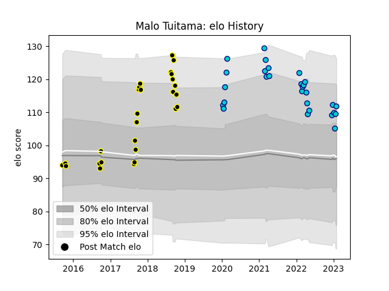

---  
layout: page  
title: Malo Tuitama  
date: 2022-12-18 16:24:12.306060  
categories: player  
---
# Malo Tuitama

## Positions: W

## Current elo: 98.0

## Current Percentile: 71.0

# Elo History

# Match History

| Team               |   Appearances |   Win Rate |
|:-------------------|--------------:|-----------:|
| Wellington         |            26 |   0.692308 |
| Shizuoka Blue Revs |            16 |   0.5625   |

| Opponent                        |   Matches |   Win Rate |
|:--------------------------------|----------:|-----------:|
| NTT Docomo Red Hurricanes Osaka |         3 |   1        |
| Southland                       |         3 |   1        |
| Otago                           |         3 |   0.666667 |
| Northland                       |         3 |   1        |
| Bay of Plenty                   |         3 |   1        |
| Auckland                        |         2 |   0        |
| Waikato                         |         2 |   0.5      |
| Toyota Verblitz                 |         2 |   0        |
| Taranaki                        |         2 |   1        |
| Yokohama Canon Eagles           |         2 |   0        |
| Hino Red Dolphins               |         2 |   1        |
| Hawke's Bay                     |         2 |   0.5      |
| Green Rockets Tokatsu           |         2 |   1        |
| Canterbury                      |         2 |   0.5      |
| Black Rams Tokyo                |         2 |   0.5      |
| Mitsubishi Dynaboars            |         1 |   1        |
| Manawatu                        |         1 |   0        |
| Saitama Wild Knights            |         1 |   0        |
| Counties Manukau                |         1 |   1        |
| Tasman                          |         1 |   0        |
| Tokyo Sungoliath                |         1 |   0        |
| North Harbour                   |         1 |   1        |