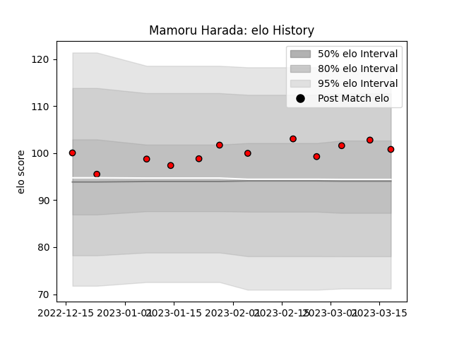

---  
layout: page  
title: Mamoru Harada  
date: 2023-03-17 17:00:14.437673  
categories: player  
---
# Mamoru Harada

## Positions: H

## Current elo: 103.0

## Current Percentile: 67.0

# Elo History

# Match History

| Team                      |   Appearances |   Win Rate |
|:--------------------------|--------------:|-----------:|
| Toshiba Brave Lupus Tokyo |            11 |   0.545455 |

| Opponent                          |   Matches |   Win Rate |
|:----------------------------------|----------:|-----------:|
| Black Rams Tokyo                  |         1 |          1 |
| Green Rockets Tokatsu             |         1 |          1 |
| Hanazono Kintetsu Liners          |         1 |          1 |
| Kobelco Kobe Steelers             |         1 |          1 |
| Kubota Spears Funabashi Tokyo-Bay |         1 |          0 |
| Mitsubishi Dynaboars              |         1 |          0 |
| Saitama Wild Knights              |         1 |          0 |
| Shizuoka Blue Revs                |         1 |          1 |
| Tokyo Sungoliath                  |         1 |          0 |
| Toyota Verblitz                   |         1 |          1 |
| Yokohama Canon Eagles             |         1 |          0 |