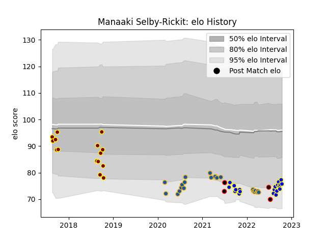

---  
layout: page  
title: Manaaki Selby-Rickit  
date: 2023-03-21 18:56:20.818861  
categories: player  
---
# Manaaki Selby-Rickit

Last updated: 2023-03-21
## Positions: L

## Country: New Zealand Maori

## Current elo: 76.0

## Current Percentile: 13.0

# Elo History

# Match History

| Team              |   Appearances |   Win Rate |
|:------------------|--------------:|-----------:|
| Highlanders       |            21 |   0.333333 |
| Bay of Plenty     |            20 |   0.5      |
| Southland         |            15 |   0        |
| New Zealand Maori |             4 |   0.75     |

| Opponent         |   Matches |   Win Rate |
|:-----------------|----------:|-----------:|
| Blues            |         6 |   0.166667 |
| Wellington       |         4 |   0.25     |
| Hawke's Bay      |         4 |   0.25     |
| Waikato          |         4 |   0.25     |
| Chiefs           |         4 |   0.75     |
| Hurricanes       |         4 |   0.25     |
| Tasman           |         3 |   0        |
| Northland        |         3 |   0.333333 |
| Auckland         |         3 |   0.333333 |
| Crusaders        |         3 |   0        |
| Ireland          |         2 |   0.5      |
| Melbourne Rebels |         2 |   0.5      |
| North Harbour    |         2 |   0.5      |
| Otago            |         2 |   0.5      |
| Samoa            |         2 |   1        |
| Southland        |         2 |   1        |
| Taranaki         |         2 |   0.5      |
| Canterbury       |         2 |   0        |
| Manawatu         |         2 |   0        |
| Bay of Plenty    |         1 |   0        |
| Moana Pasifika   |         1 |   1        |
| Counties Manukau |         1 |   0        |
| Bulls            |         1 |   0        |