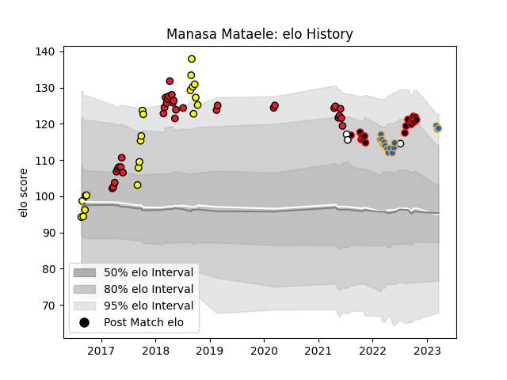

---  
layout: page  
title: Manasa Mataele  
date: 2023-03-17 17:17:44.109067  
categories: player  
---
# Manasa Mataele

## Positions: W

## Country: Fiji

## Current elo: 118.0

## Current Percentile: 93.0

# Elo History

# Match History

| Team          |   Appearances |   Win Rate |
|:--------------|--------------:|-----------:|
| Crusaders     |            33 |   0.909091 |
| Taranaki      |            21 |   0.642857 |
| Canterbury    |            16 |   0.625    |
| Western Force |            14 |   0.357143 |
| Fiji          |             3 |   0.333333 |

| Opponent                 |   Matches |   Win Rate |
|:-------------------------|----------:|-----------:|
| Blues                    |         5 |   0.8      |
| Tasman                   |         5 |   0.6      |
| New South Wales Waratahs |         5 |   0.6      |
| Melbourne Rebels         |         5 |   0.8      |
| Auckland                 |         4 |   0.5      |
| Hurricanes               |         4 |   0.75     |
| Wellington               |         4 |   0.25     |
| Queensland Reds          |         4 |   0.5      |
| Bay of Plenty            |         4 |   1        |
| Manawatu                 |         4 |   1        |
| Brumbies                 |         4 |   0.5      |
| Counties Manukau         |         4 |   1        |
| Hawke's Bay              |         3 |   0.666667 |
| Highlanders              |         3 |   0.333333 |
| Waikato                  |         3 |   0.166667 |
| Sunwolves                |         3 |   1        |
| Chiefs                   |         3 |   0.666667 |
| Stormers                 |         2 |   1        |
| Otago                    |         2 |   0.5      |
| Northland                |         2 |   0.5      |
| Western Force            |         2 |   1        |
| New Zealand              |         2 |   0        |
| Moana Pasifika           |         2 |   1        |
| Cheetahs                 |         1 |   1        |
| Canterbury               |         1 |   1        |
| Lions                    |         1 |   1        |
| Bulls                    |         1 |   1        |
| Tonga                    |         1 |   1        |
| Jaguares                 |         1 |   1        |
| Fijian Drua              |         1 |   1        |
| North Harbour            |         1 |   0        |