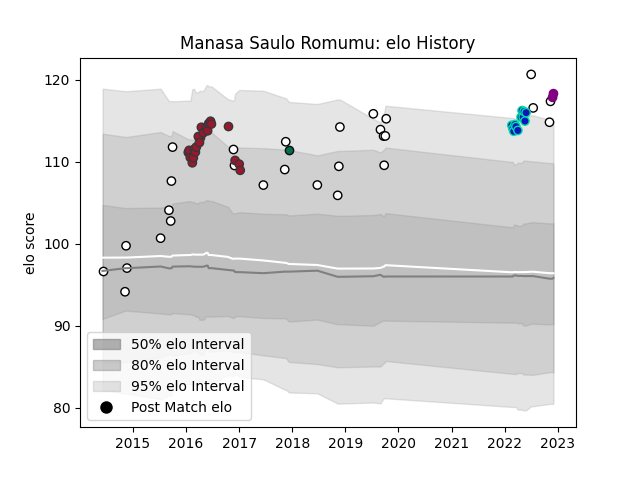

---  
layout: page  
title: Manasa Saulo Romumu  
date: 2022-11-15 23:36:08.797504  
categories: player  
---
# Manasa Saulo Romumu

## Positions: P

## Country: Fiji

## Current elo: 118.0

## Current Percentile: 95.0

# Elo History

# Match History

| Team         |   Appearances |   Win Rate |
|:-------------|--------------:|-----------:|
| Fiji         |            28 |   0.392857 |
| Toulon       |            22 |   0.590909 |
| Fijian Drua  |            12 |   0.166667 |
| London Irish |             1 |   0        |

| Opponent                 |   Matches |   Win Rate |
|:-------------------------|----------:|-----------:|
| Racing 92                |         4 |   0.5      |
| Wales                    |         3 |   0        |
| Bordeaux Begles          |         3 |   0.666667 |
| Italy                    |         3 |   0.666667 |
| Tonga                    |         3 |   0.666667 |
| England                  |         2 |   0        |
| New South Wales Waratahs |         2 |   0        |
| New Zealand Maori        |         2 |   0.5      |
| Australia                |         2 |   0        |
| Ireland                  |         2 |   0        |
| France                   |         2 |   0.5      |
| Montpellier Herault      |         2 |   0.5      |
| Scotland                 |         2 |   0        |
| Clermont Auvergne        |         2 |   0        |
| Uruguay                  |         2 |   0.5      |
| Stade Francais Paris     |         1 |   1        |
| Saracens                 |         1 |   0        |
| Samoa                    |         1 |   0        |
| Queensland Reds          |         1 |   0        |
| Stade Toulousain         |         1 |   0        |
| United States of America |         1 |   1        |
| Pau                      |         1 |   1        |
| Oyonnax                  |         1 |   1        |
| Wasps                    |         1 |   1        |
| Agen                     |         1 |   1        |
| La Rochelle              |         1 |   0        |
| Moana Pasifika           |         1 |   1        |
| Melbourne Rebels         |         1 |   1        |
| Japan                    |         1 |   1        |
| Hurricanes               |         1 |   0        |
| Highlanders              |         1 |   0        |
| Grenoble                 |         1 |   1        |
| Georgia                  |         1 |   1        |
| Edinburgh                |         1 |   0        |
| Crusaders                |         1 |   0        |
| Chiefs                   |         1 |   0        |
| Canada                   |         1 |   1        |
| Brumbies                 |         1 |   0        |
| Brive                    |         1 |   1        |
| Blues                    |         1 |   0        |
| Bath Rugby               |         1 |   1        |
| Western Force            |         1 |   0        |