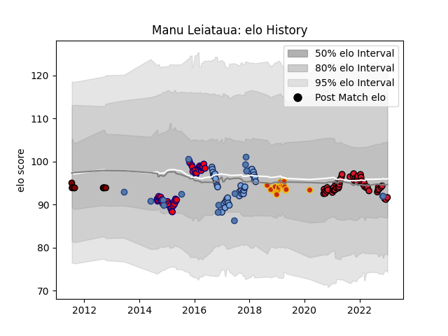

---  
layout: page  
title: Manu Leiataua  
date: 2022-11-15 23:44:26.213405  
categories: player  
---
# Manu Leiataua

## Positions: H

## Country: Samoa

## Current elo: 91.0

## Current Percentile: 27.0

# Elo History

# Match History

| Team          |   Appearances |   Win Rate |
|:--------------|--------------:|-----------:|
| Bayonne       |            35 |   0.3      |
| Oyonnax       |            33 |   0.727273 |
| Aurillac      |            23 |   0.695652 |
| Perpignan     |            15 |   0.133333 |
| Samoa         |            10 |   0.1      |
| North Harbour |             1 |   0        |

| Opponent                   |   Matches |   Win Rate |
|:---------------------------|----------:|-----------:|
| Carcassonne                |         8 |   0.875    |
| Beziers                    |         5 |   0.8      |
| Grenoble                   |         5 |   0.6      |
| Perpignan                  |         5 |   0.5      |
| Provence Rugby             |         5 |   0.8      |
| Lyon                       |         4 |   0.375    |
| Aurillac                   |         4 |   0.75     |
| La Rochelle                |         4 |   0        |
| Pau                        |         4 |   0.375    |
| Mont-de-Marsan             |         4 |   0.75     |
| Biarritz Olympique         |         4 |   0.5      |
| Vannes                     |         4 |   0.75     |
| Castres Olympique          |         3 |   0.166667 |
| Clermont Auvergne          |         3 |   0        |
| Rouen                      |         3 |   0.666667 |
| Racing 92                  |         3 |   0        |
| Bordeaux Begles            |         3 |   0.333333 |
| Nevers                     |         3 |   0.666667 |
| Narbonne                   |         3 |   0.666667 |
| Toulon                     |         3 |   0.333333 |
| Montauban                  |         2 |   0.5      |
| Scotland                   |         2 |   0        |
| Soyaux-Angouleme           |         2 |   0.5      |
| Montpellier Herault        |         2 |   0.5      |
| Sale Sharks                |         2 |   0        |
| Albi                       |         2 |   0        |
| Massy                      |         2 |   0.5      |
| Dax                        |         2 |   1        |
| Bayonne                    |         2 |   0.5      |
| Brive                      |         2 |   0.5      |
| Colomiers                  |         2 |   0        |
| Connacht                   |         2 |   0        |
| Georgia                    |         2 |   0.5      |
| England                    |         1 |   0        |
| France                     |         1 |   0        |
| Romania                    |         1 |   0        |
| Italy                      |         1 |   0        |
| New Zealand                |         1 |   0        |
| Bourgoin-Jallieu           |         1 |   0.5      |
| Stade Francais Paris       |         1 |   0        |
| Gloucester Rugby           |         1 |   0        |
| Valence Romans Drome Rugby |         1 |   1        |
| Bay of Plenty              |         1 |   0        |
| Wales                      |         1 |   0        |