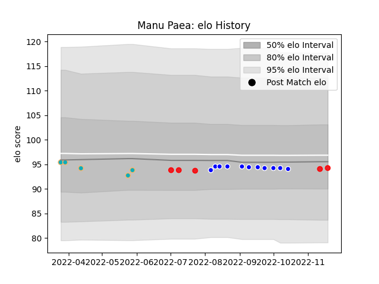

---  
layout: page  
title: Manu Paea  
date: 2023-03-21 18:02:12.114726  
categories: player  
---
# Manu Paea

Last updated: 2023-03-21
## Positions: SH

## Country: Tonga

## Current elo: 93.0

## Current Percentile: 43.0

# Elo History

# Match History

| Team           |   Appearances |   Win Rate |
|:---------------|--------------:|-----------:|
| Auckland       |            11 |   0.545455 |
| Moana Pasifika |             9 |   0.222222 |
| Tonga          |             5 |   0.6      |

| Opponent      |   Matches |   Win Rate |
|:--------------|----------:|-----------:|
| Western Force |         2 |        0   |
| Brumbies      |         2 |        0.5 |
| Hurricanes    |         2 |        0.5 |
| North Harbour |         2 |        1   |
| Northland     |         1 |        0   |
| Wellington    |         1 |        0   |
| Waikato       |         1 |        0   |
| Uruguay       |         1 |        1   |
| Tasman        |         1 |        1   |
| Taranaki      |         1 |        1   |
| Southland     |         1 |        1   |
| Samoa         |         1 |        0   |
| Bay of Plenty |         1 |        0   |
| Blues         |         1 |        0   |
| Hong Kong     |         1 |        1   |
| Fijian Drua   |         1 |        0   |
| Fiji          |         1 |        0   |
| Chile         |         1 |        1   |
| Chiefs        |         1 |        0   |
| Canterbury    |         1 |        0   |
| Manawatu      |         1 |        1   |