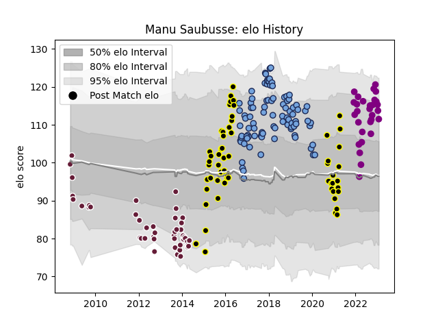

---  
layout: page  
title: Manu Saubusse  
date: 2022-12-14 11:17:47.660096  
categories: player  
---
# Manu Saubusse

## Positions: SH

## Current elo: 105.0

## Current Percentile: 82.0

# Elo History

# Match History

| Team             |   Appearances |   Win Rate |
|:-----------------|--------------:|-----------:|
| Bayonne          |            69 |   0.369565 |
| Mont-de-Marsan   |            37 |   0.635135 |
| Soyaux-Angouleme |            24 |   0.625    |
| Bordeaux Begles  |            21 |   0.238095 |

| Opponent                   |   Matches |   Win Rate |
|:---------------------------|----------:|-----------:|
| Perpignan                  |         6 |   0.5      |
| Aurillac                   |         6 |   0.666667 |
| Toulon                     |         6 |   0.166667 |
| Carcassonne                |         6 |   0.5      |
| Mont-de-Marsan             |         5 |   0.3      |
| Vannes                     |         5 |   0.4      |
| Narbonne                   |         5 |   0.6      |
| Grenoble                   |         5 |   0.2      |
| Biarritz Olympique         |         5 |   0.4      |
| Montauban                  |         5 |   0.6      |
| Colomiers                  |         5 |   0.9      |
| Albi                       |         5 |   1        |
| Dax                        |         4 |   0.625    |
| Nevers                     |         4 |   0.25     |
| Brive                      |         4 |   0.5      |
| Provence Rugby             |         4 |   0.5      |
| Montpellier Herault        |         4 |   0        |
| Beziers                    |         4 |   0.5      |
| Racing 92                  |         4 |   0        |
| Lyon                       |         3 |   0.166667 |
| La Rochelle                |         3 |   0        |
| Soyaux-Angouleme           |         3 |   0.333333 |
| Clermont Auvergne          |         3 |   0.333333 |
| Castres Olympique          |         3 |   0.166667 |
| Bourgoin-Jallieu           |         3 |   1        |
| Bayonne                    |         3 |   0.333333 |
| Scarlets                   |         2 |   0        |
| Oyonnax                    |         2 |   0.5      |
| Stade Francais Paris       |         2 |   0        |
| Pau                        |         2 |   0.25     |
| Stade Toulousain           |         2 |   0.5      |
| Tarbes                     |         2 |   1        |
| Agen                       |         2 |   0.5      |
| London Irish               |         2 |   0.5      |
| Massy                      |         2 |   1        |
| Gloucester Rugby           |         2 |   0        |
| Dragons                    |         2 |   0.5      |
| Bordeaux Begles            |         2 |   0.5      |
| Bath Rugby                 |         2 |   0        |
| Aubenas                    |         2 |   1        |
| Wasps                      |         2 |   0        |
| Mogliano                   |         1 |   1        |
| Rouen                      |         1 |   1        |
| Dijon                      |         1 |   1        |
| Cognac Saint Jean d'Angély |         1 |   1        |
| Chambery                   |         1 |   0        |
| Suresnes                   |         1 |   1        |
| Blagnac                    |         1 |   1        |
| US Bressane                |         1 |   1        |