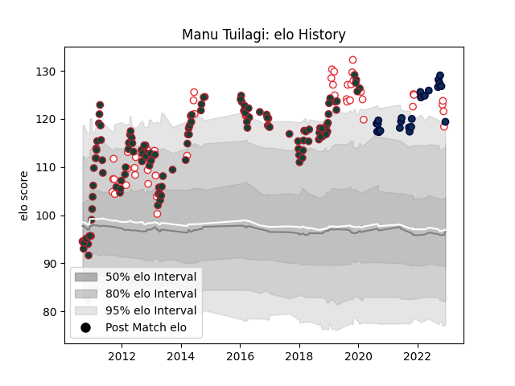

---  
layout: page  
title: Manu Tuilagi  
date: 2023-03-21 18:53:01.854731  
categories: player  
---
# Manu Tuilagi

Last updated: 2023-03-21
## Positions: C

## Country: England

## Current elo: 98.0

## Current Percentile: 100.0

# Elo History

# Match History

| Team                    |   Appearances |   Win Rate |
|:------------------------|--------------:|-----------:|
| Leicester Tigers        |           132 |   0.643939 |
| England                 |            51 |   0.637255 |
| Sale Sharks             |            31 |   0.564516 |
| British and Irish Lions |             1 |   1        |

| Opponent             |   Matches |   Win Rate |
|:---------------------|----------:|-----------:|
| Northampton Saints   |        18 |   0.722222 |
| Harlequins           |        17 |   0.588235 |
| Exeter Chiefs        |        16 |   0.4375   |
| Saracens             |        10 |   0.45     |
| Bath Rugby           |         9 |   0.555556 |
| London Irish         |         8 |   0.9375   |
| Gloucester Rugby     |         8 |   0.6875   |
| Newcastle Falcons    |         8 |   0.875    |
| South Africa         |         7 |   0.214286 |
| Wales                |         7 |   0.428571 |
| Wasps                |         7 |   0.714286 |
| France               |         6 |   0.666667 |
| Ireland              |         6 |   0.833333 |
| Sale Sharks          |         6 |   0.833333 |
| Bristol Rugby        |         6 |   0.666667 |
| Worcester Warriors   |         6 |   0.833333 |
| New Zealand          |         6 |   0.416667 |
| Australia            |         5 |   0.8      |
| Ulster               |         5 |   0.4      |
| Racing 92            |         4 |   0        |
| Argentina            |         4 |   0.75     |
| Benetton Treviso     |         4 |   1        |
| Leicester Tigers     |         4 |   0.75     |
| Munster              |         3 |   0.333333 |
| Italy                |         3 |   1        |
| Clermont Auvergne    |         3 |   0.333333 |
| Scarlets             |         3 |   1        |
| Perpignan            |         2 |   0.25     |
| Scotland             |         2 |   0.75     |
| Ospreys              |         2 |   0.75     |
| Tonga                |         2 |   1        |
| Stade Toulousain     |         2 |   0        |
| Leeds                |         2 |   1        |
| Stade Francais Paris |         2 |   0.5      |
| Pau                  |         2 |   0.5      |
| Yorkshire Carnegie   |         2 |   1        |
| Georgia              |         1 |   1        |
| London Welsh         |         1 |   1        |
| Japan                |         1 |   1        |
| Toulon               |         1 |   0        |
| Fiji                 |         1 |   1        |
| Romania              |         1 |   1        |
| Calvisano            |         1 |   1        |
| Leinster             |         1 |   0        |