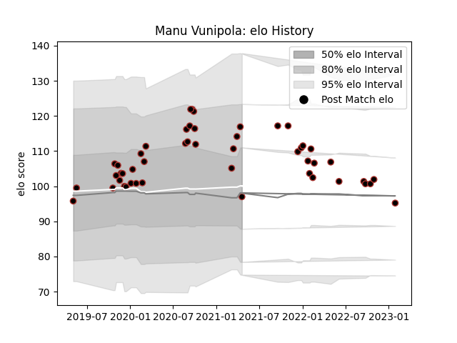

---  
layout: page  
title: Manu Vunipola  
date: 2023-01-30 11:42:12.665231  
categories: player  
---
# Manu Vunipola

## Positions: FH

## Current elo: 97.0

## Current Percentile: 85.0

# Elo History

# Match History

| Team     |   Appearances |   Win Rate |
|:---------|--------------:|-----------:|
| Saracens |            49 |   0.704082 |

| Opponent           |   Matches |   Win Rate |
|:-------------------|----------:|-----------:|
| Worcester Warriors |         5 |   0.6      |
| Harlequins         |         5 |   0.8      |
| Gloucester Rugby   |         4 |   0.75     |
| London Irish       |         4 |   0.75     |
| Bath Rugby         |         4 |   0.875    |
| Northampton Saints |         3 |   0.666667 |
| Sale Sharks        |         3 |   0.666667 |
| Exeter Chiefs      |         2 |   1        |
| Bristol Rugby      |         2 |   1        |
| Munster            |         2 |   0.5      |
| Ospreys            |         2 |   1        |
| Racing 92          |         2 |   0        |
| Wasps              |         2 |   0        |
| Leicester Tigers   |         2 |   1        |
| Edinburgh          |         1 |   0        |
| Doncaster          |         1 |   1        |
| Cornish Pirates    |         1 |   0        |
| Jersey             |         1 |   1        |
| Bedford            |         1 |   1        |
| Leinster           |         1 |   1        |
| Richmond           |         1 |   1        |