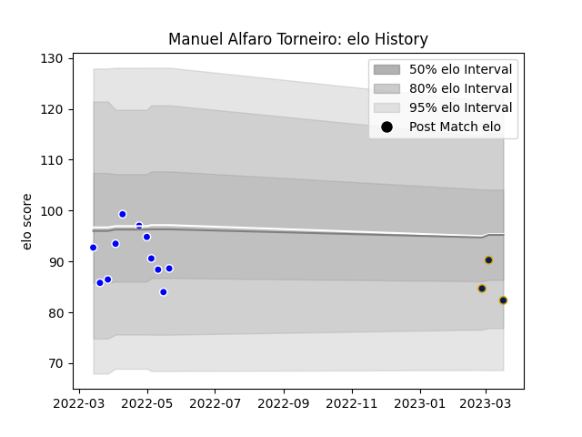

---  
layout: page  
title: Manuel Alfaro Torneiro  
date: 2023-03-04 11:43:31.115295  
categories: player  
---
# Manuel Alfaro Torneiro

## Positions: C

## Current elo: 90.0

## Current Percentile: 20.0

# Elo History

# Match History

| Team          |   Appearances |   Win Rate |
|:--------------|--------------:|-----------:|
| Cafeteros Pro |            11 |   0.363636 |
| Pampas XV     |             2 |   0.5      |

| Opponent         |   Matches |   Win Rate |
|:-----------------|----------:|-----------:|
| Penarol Rugby    |         3 |          0 |
| Selknam          |         3 |          0 |
| Cobras           |         2 |          1 |
| Jaguares XV      |         2 |          0 |
| Olimpia Lions    |         2 |          1 |
| American Raptors |         1 |          1 |