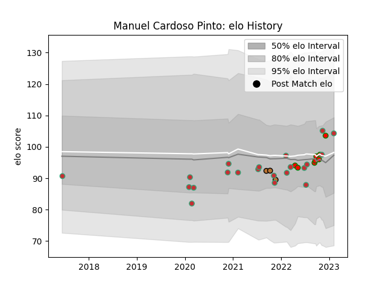

---  
layout: page  
title: Manuel Cardoso Pinto  
date: 2023-03-21 17:56:13.169108  
categories: player  
---
# Manuel Cardoso Pinto

Last updated: 2023-03-21
## Positions: FB, W

## Country: Portugal

## Current elo: 99.0

## Current Percentile: 55.0

# Elo History

# Match History

| Team         |   Appearances |   Win Rate |
|:-------------|--------------:|-----------:|
| Portugal     |            18 |   0.416667 |
| Lusitanos XV |             7 |   0.714286 |
| Narbonne     |             3 |   0.333333 |

| Opponent                 |   Matches |   Win Rate |
|:-------------------------|----------:|-----------:|
| Brazil                   |         3 |   0.666667 |
| Georgia                  |         3 |   0.166667 |
| Spain                    |         2 |   0        |
| Russia                   |         2 |   0.5      |
| Brussels Devils          |         2 |   1        |
| Romania                  |         2 |   0.5      |
| Castilla y Leon Iberians |         2 |   0.5      |
| Agen                     |         1 |   1        |
| Japan                    |         1 |   0        |
| Netherlands              |         1 |   1        |
| Montauban                |         1 |   0        |
| Delta                    |         1 |   1        |
| Italy                    |         1 |   0        |
| Argentina                |         1 |   0        |
| Colomiers                |         1 |   0        |
| Canada                   |         1 |   1        |
| Black Lion               |         1 |   0        |
| Belgium                  |         1 |   1        |
| Tel-Aviv Heat            |         1 |   1        |