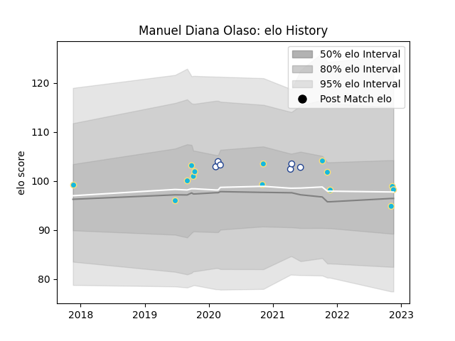

---  
layout: page  
title: Manuel Diana Olaso  
date: 2022-11-22 11:30:53.555581  
categories: player  
---
# Manuel Diana Olaso

## Positions: N8

## Country: Uruguay

## Current elo: 98.0

## Current Percentile: 55.0

# Elo History

# Match History

| Team           |   Appearances |   Win Rate |
|:---------------|--------------:|-----------:|
| Uruguay        |            14 |   0.428571 |
| Toronto Arrows |             6 |   0.5      |

| Opponent                 |   Matches |   Win Rate |
|:-------------------------|----------:|-----------:|
| Spain                    |         3 |   0.333333 |
| Romania                  |         2 |   0.5      |
| Seattle Seawolves        |         2 |   1        |
| Austin Herd              |         1 |   1        |
| Australia                |         1 |   0        |
| Brazil                   |         1 |   1        |
| Colorado Raptors         |         1 |   0        |
| Fiji                     |         1 |   1        |
| Georgia                  |         1 |   0        |
| Italy                    |         1 |   0        |
| L. A. Giltinis           |         1 |   0        |
| Namibia                  |         1 |   1        |
| San Diego Legion         |         1 |   0        |
| Tonga                    |         1 |   0        |
| United States of America |         1 |   1        |
| Wales                    |         1 |   0        |