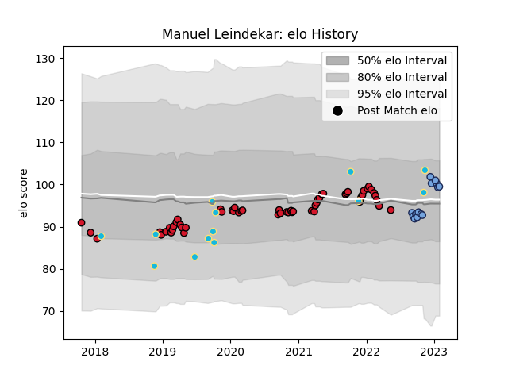

---  
layout: page  
title: Manuel Leindekar  
date: 2022-11-22 11:43:09.937933  
categories: player  
---
# Manuel Leindekar

## Positions: L

## Country: Uruguay

## Current elo: 106.0

## Current Percentile: 74.0

# Elo History

# Match History

| Team    |   Appearances |   Win Rate |
|:--------|--------------:|-----------:|
| Oyonnax |            41 |   0.670732 |
| Uruguay |            12 |   0.416667 |
| Bayonne |             8 |   0.625    |

| Opponent                   |   Matches |   Win Rate |
|:---------------------------|----------:|-----------:|
| Vannes                     |         4 |   0.75     |
| Brive                      |         4 |   0        |
| Aurillac                   |         3 |   0.666667 |
| Provence Rugby             |         3 |   0.666667 |
| Carcassonne                |         3 |   1        |
| Montauban                  |         3 |   0.5      |
| Mont-de-Marsan             |         3 |   0.666667 |
| Soyaux-Angouleme           |         2 |   1        |
| Romania                    |         2 |   1        |
| Perpignan                  |         2 |   1        |
| Nevers                     |         2 |   1        |
| Rouen                      |         2 |   0.5      |
| Grenoble                   |         2 |   0.5      |
| Georgia                    |         2 |   0        |
| Fiji                       |         2 |   0.5      |
| Valence Romans Drome Rugby |         2 |   1        |
| Beziers                    |         2 |   1        |
| Toulon                     |         1 |   0        |
| Stade Toulousain           |         1 |   1        |
| Stade Francais Paris       |         1 |   0        |
| United States of America   |         1 |   1        |
| Spain                      |         1 |   0        |
| Wales                      |         1 |   0        |
| US Bressane                |         1 |   0        |
| Narbonne                   |         1 |   1        |
| Racing 92                  |         1 |   1        |
| Australia                  |         1 |   0        |
| Massy                      |         1 |   1        |
| La Rochelle                |         1 |   1        |
| Italy                      |         1 |   0        |
| Brazil                     |         1 |   1        |
| Bordeaux Begles            |         1 |   1        |
| Biarritz Olympique         |         1 |   1        |
| Bayonne                    |         1 |   0        |
| Worcester Warriors         |         1 |   0        |