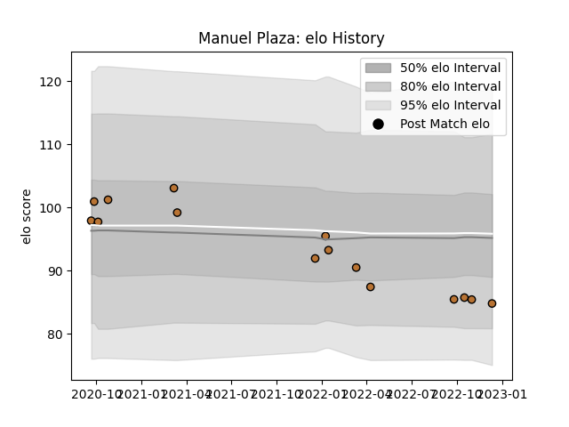

---  
layout: page  
title: Manuel Plaza  
date: 2022-12-18 16:31:28.384710  
categories: player  
---
# Manuel Plaza

## Positions: L

## Current elo: 85.0

## Current Percentile: 16.0

# Elo History

# Match History

| Team     |   Appearances |   Win Rate |
|:---------|--------------:|-----------:|
| Narbonne |            15 |   0.133333 |

| Opponent                   |   Matches |   Win Rate |
|:---------------------------|----------:|-----------:|
| Albi                       |         2 |        0   |
| Dijon                      |         2 |        0.5 |
| Agen                       |         1 |        0   |
| Aubenas                    |         1 |        0   |
| Aurillac                   |         1 |        0   |
| Chambery                   |         1 |        0   |
| Cognac Saint Jean d'Angély |         1 |        1   |
| Colomiers                  |         1 |        0   |
| Dax                        |         1 |        0   |
| Nevers                     |         1 |        0   |
| Oyonnax                    |         1 |        0   |
| Suresnes                   |         1 |        0   |
| Tarbes                     |         1 |        0   |