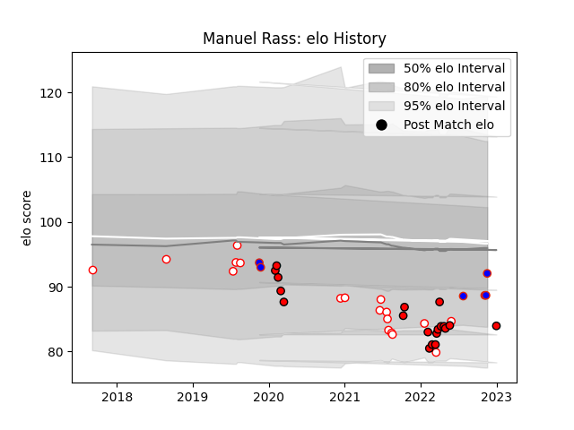

---  
layout: page  
title: Manuel Rass  
date: 2023-02-02 18:59:12.103420  
categories: player  
---
# Manuel Rass

## Positions: C

## Country: Hong Kong

## Current elo: 91.0

## Current Percentile: 23.0

# Elo History

# Match History

| Team         |   Appearances |   Win Rate |
|:-------------|--------------:|-----------:|
| Lions        |            21 |   0.333333 |
| Golden Lions |            18 |   0.5      |
| Hong Kong    |             6 |   0.333333 |

| Opponent                 |   Matches |   Win Rate |
|:-------------------------|----------:|-----------:|
| Pumas                    |         6 |   0.5      |
| Western Province         |         4 |   0.75     |
| Griquas                  |         3 |   0.333333 |
| Stormers                 |         3 |   0        |
| Blue Bulls               |         2 |   0        |
| Munster                  |         2 |   0.5      |
| Connacht                 |         2 |   0        |
| Free State Cheetahs      |         2 |   1        |
| Portugal                 |         1 |   0        |
| Queensland Reds          |         1 |   1        |
| Spain                    |         1 |   0        |
| Sharks                   |         1 |   0        |
| New South Wales Waratahs |         1 |   0        |
| Tonga                    |         1 |   0        |
| Ulster                   |         1 |   0        |
| United States of America |         1 |   0        |
| Ospreys                  |         1 |   1        |
| Belgium                  |         1 |   1        |
| Natal Sharks             |         1 |   0        |
| Benetton Treviso         |         1 |   1        |
| Kenya                    |         1 |   1        |
| Jaguares                 |         1 |   0        |
| Glasgow Warriors         |         1 |   0        |
| Edinburgh                |         1 |   1        |
| Dragons                  |         1 |   1        |
| Cardiff Blues            |         1 |   1        |
| Bulls                    |         1 |   0        |
| Blues                    |         1 |   0        |
| Leinster                 |         1 |   0        |