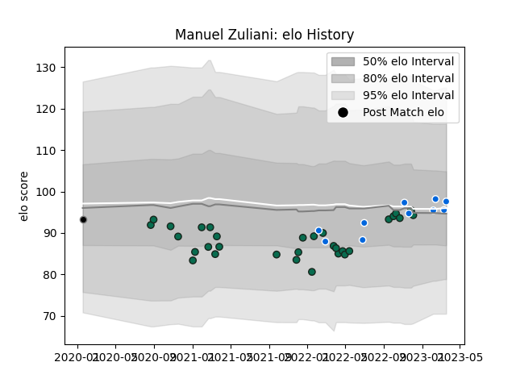

---  
layout: page  
title: Manuel Zuliani  
date: 2023-01-06 00:09:49.304762  
categories: player  
---
# Manuel Zuliani

## Positions: FL

## Country: Italy

## Current elo: 103.0

## Current Percentile: 31.0

# Elo History

# Match History

| Team             |   Appearances |   Win Rate |
|:-----------------|--------------:|-----------:|
| Benetton Treviso |            29 |   0.344828 |
| Italy            |             6 |   0.5      |
| Calvisano        |             1 |   0        |

| Opponent         |   Matches |   Win Rate |
|:-----------------|----------:|-----------:|
| Zebre            |         7 |   0.571429 |
| Glasgow Warriors |         4 |   0.5      |
| Connacht         |         3 |   0        |
| Scarlets         |         3 |   0.333333 |
| Munster          |         3 |   0        |
| Cardiff Blues    |         3 |   0        |
| Bulls            |         2 |   0        |
| Edinburgh        |         2 |   0.5      |
| Ireland          |         1 |   0        |
| France           |         1 |   0        |
| Portugal         |         1 |   1        |
| Romania          |         1 |   1        |
| Samoa            |         1 |   1        |
| Dragons          |         1 |   1        |
| South Africa     |         1 |   0        |
| Stormers         |         1 |   1        |
| Lions            |         1 |   0        |