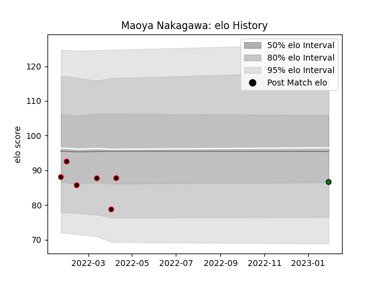

---  
layout: page  
title: Maoya Nakagawa  
date: 2023-02-02 18:54:47.355154  
categories: player  
---
# Maoya Nakagawa

## Positions: L

## Current elo: 87.0

## Current Percentile: 27.0

# Elo History

# Match History

| Team                 |   Appearances |   Win Rate |
|:---------------------|--------------:|-----------:|
| Mie Honda Heat       |             6 |   0.666667 |
| Mitsubishi Dynaboars |             1 |   0        |

| Opponent                 |   Matches |   Win Rate |
|:-------------------------|----------:|-----------:|
| Mitsubishi Dynaboars     |         2 |        0.5 |
| Hanazono Kintetsu Liners |         1 |        0   |
| Hino Red Dolphins        |         1 |        1   |
| Kamaishi Seawaves        |         1 |        1   |
| Skyactivs Hiroshima      |         1 |        1   |
| Tokyo Sungoliath         |         1 |        0   |