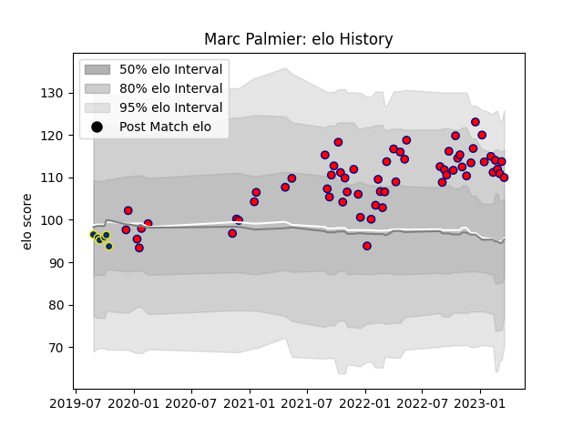

---  
layout: page  
title: Marc Palmier  
date: 2022-11-22 11:45:43.254327  
categories: player  
---
# Marc Palmier

## Positions: FH

## Current elo: 100.0

## Current Percentile: 66.0

# Elo History

# Match History

| Team              |   Appearances |   Win Rate |
|:------------------|--------------:|-----------:|
| Aurillac          |            42 |   0.547619 |
| Clermont Auvergne |             1 |   0        |

| Opponent           |   Matches |   Win Rate |
|:-------------------|----------:|-----------:|
| Grenoble           |         4 |   0.25     |
| Mont-de-Marsan     |         4 |   0.25     |
| Agen               |         3 |   0.333333 |
| Rouen              |         3 |   0.666667 |
| Provence Rugby     |         3 |   0.666667 |
| Nevers             |         3 |   0.666667 |
| Montauban          |         3 |   0.666667 |
| Beziers            |         3 |   0.666667 |
| Colomiers          |         2 |   0.5      |
| Carcassonne        |         2 |   0.5      |
| Narbonne           |         2 |   1        |
| Oyonnax            |         2 |   1        |
| US Bressane        |         2 |   0.5      |
| Massy              |         1 |   1        |
| Bayonne            |         1 |   0        |
| Bordeaux Begles    |         1 |   0        |
| Perpignan          |         1 |   0        |
| Biarritz Olympique |         1 |   0        |
| Soyaux-Angouleme   |         1 |   1        |
| Vannes             |         1 |   1        |