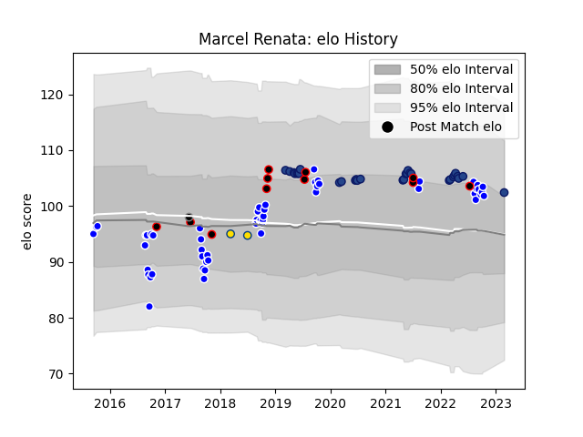

---  
layout: page  
title: Marcel Renata  
date: 2023-03-02 11:25:51.484018  
categories: player  
---
# Marcel Renata

## Positions: P

## Country: New Zealand Maori

## Current elo: 102.0

## Current Percentile: 75.0

# Elo History

# Match History

| Team                |   Appearances |   Win Rate |
|:--------------------|--------------:|-----------:|
| Auckland            |            52 |   0.576923 |
| Blues               |            30 |   0.716667 |
| New Zealand Maori   |            11 |   0.727273 |
| Hurricanes          |             2 |   0.5      |
| Provincial Union XV |             1 |   0        |

| Opponent                 |   Matches |   Win Rate |
|:-------------------------|----------:|-----------:|
| Canterbury               |         6 |   0.5      |
| Tasman                   |         6 |   0.166667 |
| Taranaki                 |         5 |   0.6      |
| Northland                |         5 |   0.8      |
| Otago                    |         5 |   0.6      |
| Hurricanes               |         5 |   0.2      |
| Southland                |         5 |   1        |
| Counties Manukau         |         4 |   0.5      |
| Highlanders              |         4 |   1        |
| North Harbour            |         4 |   0.75     |
| Chiefs                   |         4 |   1        |
| Waikato                  |         4 |   0.25     |
| Wellington               |         4 |   0.5      |
| Crusaders                |         3 |   0.333333 |
| New South Wales Waratahs |         3 |   1        |
| Brumbies                 |         3 |   0.333333 |
| Bay of Plenty            |         3 |   0.666667 |
| Samoa                    |         2 |   1        |
| United States of America |         2 |   1        |
| Western Force            |         2 |   1        |
| Fiji                     |         2 |   0.5      |
| British and Irish Lions  |         2 |   0        |
| Moana Pasifika           |         1 |   1        |
| Melbourne Rebels         |         1 |   1        |
| Brazil                   |         1 |   1        |
| Ireland                  |         1 |   0        |
| Queensland Reds          |         1 |   0        |
| Hawke's Bay              |         1 |   1        |
| Fijian Drua              |         1 |   1        |
| Stormers                 |         1 |   1        |
| Sunwolves                |         1 |   1        |
| Chile                    |         1 |   1        |
| Canada                   |         1 |   1        |
| Bulls                    |         1 |   0.5      |
| Lions                    |         1 |   1        |