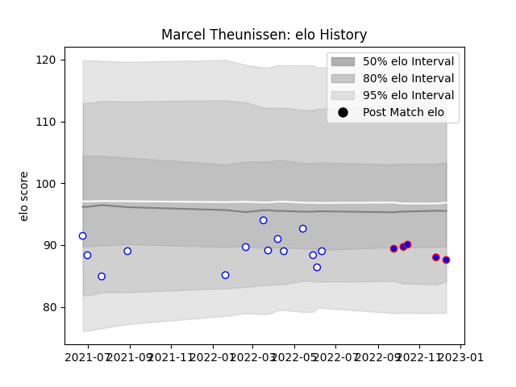

---  
layout: page  
title: Marcel Theunissen  
date: 2023-01-06 00:18:00.802003  
categories: player  
---
# Marcel Theunissen

## Positions: FL

## Current elo: 99.0

## Current Percentile: 26.0

# Elo History

# Match History

| Team             |   Appearances |   Win Rate |
|:-----------------|--------------:|-----------:|
| Western Province |            19 |   0.315789 |
| Stormers         |             8 |   0.8125   |

| Opponent            |   Matches |   Win Rate |
|:--------------------|----------:|-----------:|
| Free State Cheetahs |         4 |       0.25 |
| Golden Lions        |         4 |       0.25 |
| Griquas             |         4 |       0    |
| Natal Sharks        |         3 |       1    |
| Blue Bulls          |         2 |       0    |
| Pumas               |         2 |       0.5  |
| Bulls               |         1 |       1    |
| Clermont Auvergne   |         1 |       0    |
| Connacht            |         1 |       1    |
| Lions               |         1 |       1    |
| London Irish        |         1 |       1    |
| Ospreys             |         1 |       0.5  |
| Scarlets            |         1 |       1    |
| Zebre               |         1 |       1    |