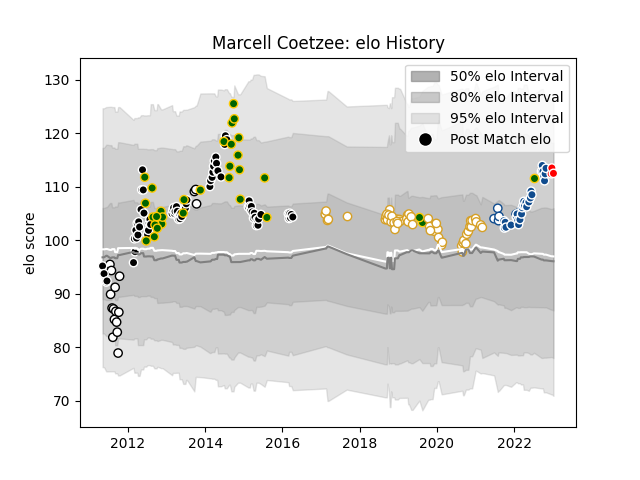

---  
layout: page  
title: Marcell Coetzee  
date: 2022-12-28 12:56:17.359247  
categories: player  
---
# Marcell Coetzee

## Positions: FL, N8

## Country: South Africa

## Current elo: 109.0

## Current Percentile: 83.0

# Elo History

# Match History

| Team                  |   Appearances |   Win Rate |
|:----------------------|--------------:|-----------:|
| Sharks                |            73 |   0.547945 |
| Ulster                |            55 |   0.736364 |
| South Africa          |            31 |   0.645161 |
| Bulls                 |            28 |   0.642857 |
| Natal Sharks          |            18 |   0.722222 |
| Blue Bulls            |             6 |   0.833333 |
| Kobelco Kobe Steelers |             2 |   0.5      |

| Opponent                 |   Matches |   Win Rate |
|:-------------------------|----------:|-----------:|
| Stormers                 |        13 |   0.461538 |
| Lions                    |        11 |   0.681818 |
| Bulls                    |        11 |   0.318182 |
| Cheetahs                 |        11 |   0.681818 |
| Leinster                 |         7 |   0.142857 |
| Glasgow Warriors         |         7 |   0.571429 |
| Edinburgh                |         7 |   0.857143 |
| Connacht                 |         7 |   0.428571 |
| Argentina                |         6 |   0.75     |
| Scarlets                 |         6 |   0.833333 |
| Australia                |         6 |   0.5      |
| Southern Kings           |         6 |   1        |
| England                  |         5 |   0.9      |
| Benetton Treviso         |         5 |   1        |
| Western Province         |         5 |   0.6      |
| Griquas                  |         5 |   0.8      |
| Queensland Reds          |         5 |   0.8      |
| Highlanders              |         4 |   0.25     |
| Scotland                 |         4 |   1        |
| New Zealand              |         4 |   0.25     |
| Munster                  |         4 |   0.75     |
| Sharks                   |         4 |   0.5      |
| Zebre                    |         4 |   1        |
| Chiefs                   |         4 |   0.25     |
| Crusaders                |         4 |   0.25     |
| Ospreys                  |         3 |   0.666667 |
| Blue Bulls               |         3 |   1        |
| Brumbies                 |         3 |   0.666667 |
| Free State Cheetahs      |         3 |   0.666667 |
| Cardiff Blues            |         3 |   1        |
| Dragons                  |         3 |   1        |
| New South Wales Waratahs |         3 |   0.333333 |
| Hurricanes               |         3 |   0.333333 |
| Pumas                    |         3 |   1        |
| Racing 92                |         2 |   0.5      |
| Bath Rugby               |         2 |   1        |
| Western Force            |         2 |   1        |
| Wales                    |         2 |   0        |
| Blues                    |         2 |   1        |
| Harlequins               |         2 |   1        |
| Clermont Auvergne        |         2 |   0.5      |
| Melbourne Rebels         |         2 |   1        |
| Leopards                 |         2 |   1        |
| Golden Lions             |         2 |   0.5      |
| Leicester Tigers         |         2 |   1        |
| Ireland                  |         2 |   0.5      |
| Italy                    |         2 |   1        |
| Natal Sharks             |         1 |   0        |
| Ulster                   |         1 |   1        |
| Jaguares                 |         1 |   1        |
| Hanazono Kintetsu Liners |         1 |   1        |
| Yokohama Canon Eagles    |         1 |   0        |