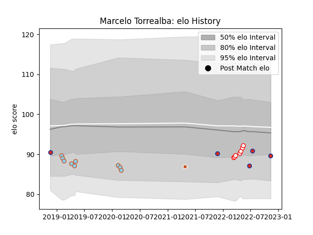

---  
layout: page  
title: Marcelo Torrealba  
date: 2022-11-16 11:26:03.475940  
categories: player  
---
# Marcelo Torrealba

## Positions: SH

## Country: Chile

## Current elo: 88.0

## Current Percentile: 20.0

# Elo History

# Match History

| Team               |   Appearances |   Win Rate |
|:-------------------|--------------:|-----------:|
| Selknam            |             7 |   0.857143 |
| Austin Elite Rugby |             6 |   0        |
| Chile              |             6 |   0.333333 |
| Austin Herd        |             3 |   0.166667 |
| Austin Gilgronis   |             1 |   1        |

| Opponent                 |   Matches |   Win Rate |
|:-------------------------|----------:|-----------:|
| Utah Warriors            |         3 |   0.166667 |
| Toronto Arrows           |         2 |   0        |
| Olimpia Lions            |         2 |   0.5      |
| Cobras                   |         2 |   1        |
| Russia                   |         1 |   1        |
| United States of America |         1 |   1        |
| Tonga                    |         1 |   0        |
| Seattle Seawolves        |         1 |   1        |
| Scotland                 |         1 |   0        |
| San Diego Legion         |         1 |   0        |
| Cafeteros Pro            |         1 |   1        |
| Penarol Rugby            |         1 |   1        |
| Old Glory DC             |         1 |   0        |
| New Zealand Maori        |         1 |   0        |
| NOLA Gold                |         1 |   0        |
| Jaguares XV              |         1 |   1        |
| Glendale Raptors         |         1 |   0        |
| Romania                  |         1 |   0        |