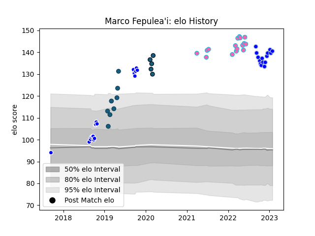

---  
layout: page  
title: Marco Fepulea'i  
date: 2022-11-22 11:40:26.613310  
categories: player  
---
# Marco Fepulea'i

## Positions: P

## Current elo: 106.0

## Current Percentile: 89.0

# Elo History

# Match History

| Team             |   Appearances |   Win Rate |
|:-----------------|--------------:|-----------:|
| Auckland         |            18 |   0.722222 |
| L. A. Giltinis   |            14 |   0.642857 |
| Colomiers        |             9 |   0.444444 |
| Glendale Raptors |             8 |   0.5      |
| Colorado Raptors |             5 |   0.4      |

| Opponent           |   Matches |   Win Rate |
|:-------------------|----------:|-----------:|
| Seattle Seawolves  |         4 |   0.5      |
| San Diego Legion   |         4 |   0.25     |
| Utah Warriors      |         4 |   0.75     |
| R.U. New York      |         3 |   0.666667 |
| Austin Gilgronis   |         3 |   0.666667 |
| Taranaki           |         3 |   0.666667 |
| Tasman             |         3 |   0.333333 |
| Wellington         |         3 |   0.666667 |
| Houston SaberCats  |         3 |   0.333333 |
| Counties Manukau   |         2 |   1        |
| NOLA Gold          |         2 |   0        |
| Canterbury         |         2 |   1        |
| Southland          |         2 |   1        |
| Toronto Arrows     |         2 |   1        |
| Soyaux-Angouleme   |         1 |   1        |
| Vannes             |         1 |   0        |
| Waikato            |         1 |   1        |
| Austin Elite Rugby |         1 |   1        |
| Rouen              |         1 |   0        |
| Otago              |         1 |   0        |
| North Harbour      |         1 |   1        |
| Nevers             |         1 |   1        |
| Montauban          |         1 |   0        |
| Mont-de-Marsan     |         1 |   0        |
| Dallas Jackals     |         1 |   1        |
| Biarritz Olympique |         1 |   0        |
| Beziers            |         1 |   1        |
| Provence Rugby     |         1 |   1        |