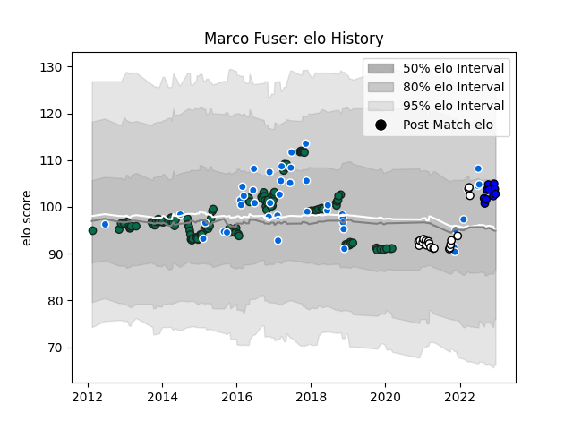

---  
layout: page  
title: Marco Fuser  
date: 2023-01-13 11:37:12.485803  
categories: player  
---
# Marco Fuser

## Positions: L

## Country: Italy

## Current elo: 109.0

## Current Percentile: 79.0

# Elo History

# Match History

| Team              |   Appearances |   Win Rate |
|:------------------|--------------:|-----------:|
| Benetton Treviso  |           124 |   0.306452 |
| Italy             |            42 |   0.333333 |
| Newcastle Falcons |            18 |   0.444444 |
| Massy             |            11 |   0.272727 |

| Opponent                 |   Matches |   Win Rate |
|:-------------------------|----------:|-----------:|
| Zebre                    |        12 |   0.666667 |
| Leinster                 |        11 |   0.136364 |
| Edinburgh                |        10 |   0.4      |
| Dragons                  |        10 |   0.4      |
| Ospreys                  |         9 |   0.333333 |
| Connacht                 |         8 |   0.25     |
| Cardiff Blues            |         8 |   0.3125   |
| Scarlets                 |         8 |   0.25     |
| Munster                  |         7 |   0.285714 |
| Glasgow Warriors         |         7 |   0        |
| Ulster                   |         6 |   0.166667 |
| Scotland                 |         5 |   0.2      |
| Wasps                    |         4 |   0.5      |
| Ireland                  |         4 |   0        |
| Harlequins               |         4 |   0.5      |
| Gloucester Rugby         |         4 |   0.25     |
| Northampton Saints       |         3 |   0        |
| New Zealand              |         3 |   0        |
| Argentina                |         3 |   0        |
| Leicester Tigers         |         3 |   0        |
| Japan                    |         3 |   0.333333 |
| Agen                     |         3 |   0.333333 |
| Georgia                  |         3 |   0.666667 |
| Canada                   |         3 |   1        |
| France                   |         3 |   0        |
| Bath Rugby               |         3 |   0.666667 |
| Bayonne                  |         2 |   1        |
| Sale Sharks              |         2 |   0.5      |
| Grenoble                 |         2 |   0.5      |
| Racing 92                |         2 |   0        |
| Toulon                   |         2 |   0        |
| Australia                |         2 |   0        |
| Bristol Rugby            |         2 |   0        |
| Montpellier Herault      |         2 |   0        |
| Wales                    |         2 |   0.5      |
| England                  |         2 |   0        |
| Fiji                     |         2 |   0.5      |
| South Africa             |         2 |   0.5      |
| United States of America |         1 |   1        |
| Southern Kings           |         1 |   1        |
| Uruguay                  |         1 |   1        |
| Vannes                   |         1 |   1        |
| Tonga                    |         1 |   0        |
| Stade Toulousain         |         1 |   0        |
| Stade Francais Paris     |         1 |   0        |
| Aurillac                 |         1 |   0        |
| Soyaux-Angouleme         |         1 |   0        |
| Worcester Warriors       |         1 |   1        |
| Rouen                    |         1 |   0        |
| Saracens                 |         1 |   0        |
| Romania                  |         1 |   1        |
| Provence Rugby           |         1 |   1        |
| Portugal                 |         1 |   1        |
| Oyonnax                  |         1 |   0        |
| Beziers                  |         1 |   0        |
| Carcassonne              |         1 |   1        |
| Cheetahs                 |         1 |   1        |
| London Irish             |         1 |   0        |
| Colomiers                |         1 |   0        |
| La Rochelle              |         1 |   0        |
| Exeter Chiefs            |         1 |   0        |
| Lyon                     |         1 |   1        |