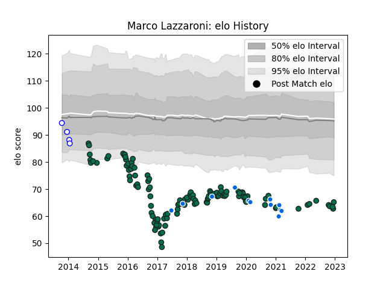

---  
layout: page  
title: Marco Lazzaroni  
date: 2022-12-09 13:21:59.200613  
categories: player  
---
# Marco Lazzaroni

## Positions: FL, L

## Country: Italy

## Current elo: 63.0

## Current Percentile: 0.0

# Elo History

# Match History

| Team             |   Appearances |   Win Rate |
|:-----------------|--------------:|-----------:|
| Benetton Treviso |           121 |  0.293388  |
| Italy            |            12 |  0.0833333 |
| Mogliano         |             4 |  0         |

| Opponent             |   Matches |   Win Rate |
|:---------------------|----------:|-----------:|
| Zebre                |        12 |  0.666667  |
| Dragons              |        11 |  0.590909  |
| Leinster             |        11 |  0.136364  |
| Glasgow Warriors     |        10 |  0.1       |
| Scarlets             |        10 |  0.2       |
| Munster              |         9 |  0         |
| Connacht             |         8 |  0.125     |
| Ulster               |         7 |  0.0714286 |
| Cardiff Blues        |         7 |  0.285714  |
| Edinburgh            |         7 |  0.428571  |
| Ospreys              |         6 |  0.166667  |
| Ireland              |         4 |  0         |
| Northampton Saints   |         3 |  0         |
| Southern Kings       |         3 |  1         |
| Bayonne              |         2 |  1         |
| Wales                |         2 |  0         |
| Bath Rugby           |         2 |  0         |
| Toulon               |         2 |  0         |
| Stade Francais Paris |         2 |  0         |
| Agen                 |         2 |  0.5       |
| England              |         2 |  0         |
| Leicester Tigers     |         2 |  0         |
| La Rochelle          |         2 |  0         |
| Grenoble             |         2 |  1         |
| Gloucester Rugby     |         2 |  0         |
| Lyon                 |         1 |  1         |
| Cheetahs             |         1 |  0         |
| Fiji                 |         1 |  1         |
| Bordeaux Begles      |         1 |  0         |
| Scotland             |         1 |  0         |
| Australia            |         1 |  0         |
| France               |         1 |  0         |