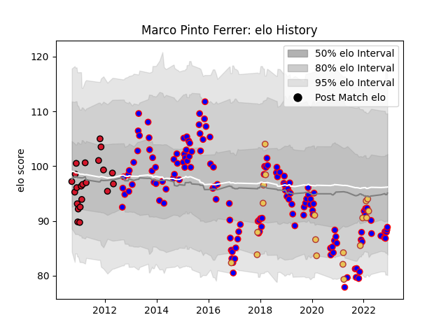

---  
layout: page  
title: Marco Pinto Ferrer  
date: 2022-12-12 14:58:16.349223  
categories: player  
---
# Marco Pinto Ferrer

## Positions: H

## Country: Spain

## Current elo: 89.0

## Current Percentile: 18.0

# Elo History

# Match History

| Team    |   Appearances |   Win Rate |
|:--------|--------------:|-----------:|
| Beziers |           144 |   0.538194 |
| Oyonnax |            22 |   0.522727 |
| Spain   |            19 |   0.578947 |

| Opponent           |   Matches |   Win Rate |
|:-------------------|----------:|-----------:|
| Colomiers          |        15 |   0.7      |
| Aurillac           |        13 |   0.307692 |
| Carcassonne        |        13 |   0.576923 |
| Mont-de-Marsan     |        12 |   0.583333 |
| Provence Rugby     |        10 |   0.5      |
| Dax                |         9 |   0.666667 |
| Narbonne           |         8 |   0.6875   |
| Tarbes             |         6 |   0.666667 |
| Montauban          |         6 |   0.666667 |
| Biarritz Olympique |         6 |   0.166667 |
| Oyonnax            |         6 |   0.333333 |
| Nevers             |         6 |   0.5      |
| Grenoble           |         5 |   0.4      |
| Agen               |         5 |   0.8      |
| Perpignan          |         5 |   0.4      |
| Albi               |         4 |   0.5      |
| Romania            |         4 |   0.5      |
| Soyaux-Angouleme   |         4 |   0.75     |
| US Bressane        |         4 |   0.25     |
| Massy              |         4 |   1        |
| Lyon               |         4 |   0.125    |
| Bayonne            |         4 |   0.5      |
| Pau                |         3 |   0.333333 |
| Russia             |         3 |   1        |
| Rouen              |         3 |   1        |
| Vannes             |         3 |   0        |
| Portugal           |         2 |   0.5      |
| La Rochelle        |         2 |   0        |
| Netherlands        |         2 |   1        |
| Georgia            |         2 |   0        |
| Belgium            |         2 |   0.5      |
| Bourgoin-Jallieu   |         2 |   1        |
| Brive              |         1 |   1        |
| Canada             |         1 |   0        |
| Brazil             |         1 |   1        |
| Beziers            |         1 |   1        |
| Saint-Etienne      |         1 |   1        |
| Germany            |         1 |   1        |
| Tonga              |         1 |   0        |
| Auch               |         1 |   0        |