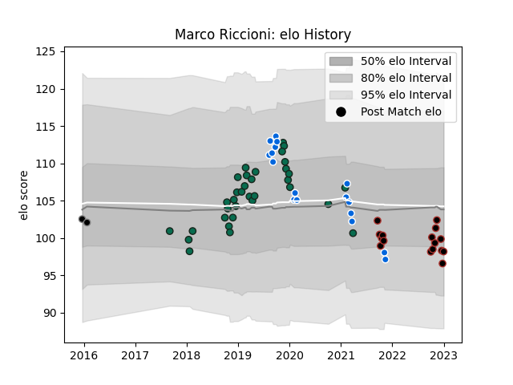

---  
layout: page  
title: Marco Riccioni  
date: 2022-12-18 16:39:41.102223  
categories: player  
---
# Marco Riccioni

## Positions: P

## Country: Italy

## Current elo: 94.0

## Current Percentile: 45.0

# Elo History

# Match History

| Team             |   Appearances |   Win Rate |
|:-----------------|--------------:|-----------:|
| Benetton Treviso |            34 |   0.352941 |
| Italy            |            17 |   0.176471 |
| Saracens         |            14 |   0.928571 |
| Calvisano        |             2 |   0        |

| Opponent           |   Matches |   Win Rate |
|:-------------------|----------:|-----------:|
| Zebre              |         5 |   1        |
| Munster            |         4 |   0        |
| Edinburgh          |         3 |   0.666667 |
| Ulster             |         3 |   0.166667 |
| Scarlets           |         3 |   0.666667 |
| Harlequins         |         3 |   0.333333 |
| France             |         3 |   0        |
| Leinster           |         3 |   0.166667 |
| Bath Rugby         |         3 |   0.666667 |
| Leicester Tigers   |         2 |   0.5      |
| Ireland            |         2 |   0        |
| Northampton Saints |         2 |   0.5      |
| Newcastle Falcons  |         2 |   1        |
| Lyon               |         2 |   0.5      |
| Bristol Rugby      |         2 |   1        |
| Scotland           |         2 |   0        |
| Cardiff Blues      |         2 |   0        |
| Wales              |         2 |   0        |
| Glasgow Warriors   |         2 |   0        |
| England            |         2 |   0        |
| Toulon             |         1 |   0        |
| Southern Kings     |         1 |   1        |
| South Africa       |         1 |   0        |
| Wasps              |         1 |   1        |
| Dragons            |         1 |   1        |
| New Zealand        |         1 |   0        |
| Sale Sharks        |         1 |   1        |
| Russia             |         1 |   1        |
| Connacht           |         1 |   0        |
| Namibia            |         1 |   1        |
| Canada             |         1 |   1        |
| Argentina          |         1 |   0        |
| Grenoble           |         1 |   1        |
| Cheetahs           |         1 |   0        |
| Agen               |         1 |   0        |